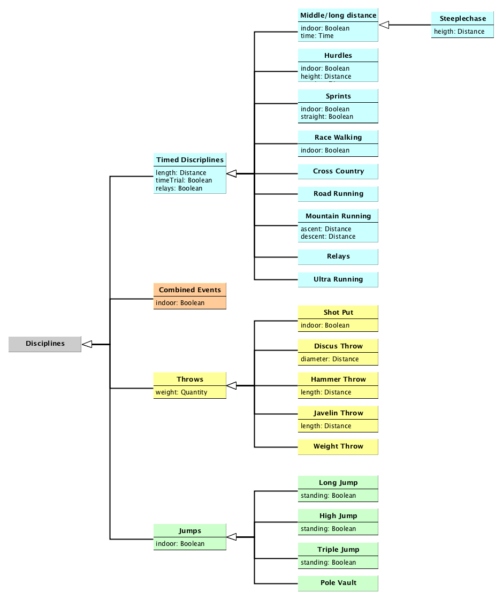
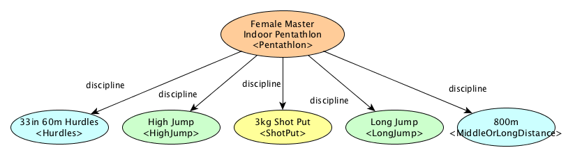

# Athletics Disciplines

Athletics events may be defined depending on the main target of the discipline, and main rules of the competition: *timed events* for events involving timekeeping and the performance is measured as time; *field events* for jumps and throws; and *combined events* that are a combination of *timed* and *field* events.

[According to IAAF](https://www.iaaf.org/disciplines), Athletics events may be classified into: _Sprints_, _Middle/long distance_, _Hurdles_, _Road Running_, _Jumps_, _Throws_, _Combined Events_, _Race Walks_, _Relays_, _Cross Country_, _Mountain Running_ and _Ultra Running_. IOC [ODF uses]: _Races (track and road) and relays_, _Throws_, _Horizontal Jumps_ and _Vertical Jumps_. [Athlib uses codes](http://opentrack.run/athlib/build/html/eventcodes.html) for all disciplines.

Disciplines are described by specific features (i.e., throws disciplines, such as shot put, are defined by *weight*). So, having into account the features related to the competition, disciplines are modeled in this taxonomy of concepts:

This taxonomy includes `Steeplechase` as a narrower concept of `Middle/Long Distance` because of the different nature of this kind of events.

This hierarchical taxonomy enables the definition of any type of Athletic event.

_Example of an instance of Master Female indoor Pentathlon using the current model:_

## Classes

* [Discipline](#discipline)
  * [Race](#race)
    * [Middle Or Long Distance](#middle-or-long-distance)
      * [Steeplechase](#steeplechase)
    * [Hurdles](#hurdles)
    * [Sprints](#sprints)
    * [Race Walking](#race-walking)
    * [Cross Country](#cross-country)
    * [Road Running](#road-running)
    * [Mountain Running](#mountain-running)
    * [Track Relays](#track-relays)
    * [Ultra Running](#ultra-running)
  * [Throws](#throws)
    * [Shot Put](#shot-put)
    * [Discus Throw](#discus-throw)
    * [Hammer Throw](#hammer-throw)
    * [Javelin Throw](#javelin-throw)
    * [Weight Throw](#weight-throw) 
  * [Horizontal Jumps](#horizontal-jumps)
    * [Long Jump](#long-jump)
    * [Triple Jump](#triple-jump)
  * [Vertical Jumps](#vertical-jumps)
    * [High Jump](#high-jump)
    * [Pole Vault](#pole-vault)
  * [Combined Event](#combined-event)  
    * [Pentathlon](#pentathlon)
    * [Heptathlon](Heptathlon)
    * [Decathlon](#decathlon)
    * [Throws Pentathlon](#throws-pentathlon) 

### Discipline

Children: [Race](#race), [Throws](#throws), [Horizontal Jumps](#horizontal-jumps), [Vertical Jumps](#vertical-jumps), [Combined Event](#combined-event)  

| Property | Description | Value Type |
|:-------- |:----------- |:---------- |
| stadium type | Type of the stadium (indoor/outdoor). | Stadium Type |
| name | Descriptive name of the discipline. | Text |

### Race

* Parent: [Discipline](#discipline)
* Children: [Middle Or Long Distance](#middle-or-long-distance), [Hurdles](#hurdles), [Sprints](#sprints), [Race Walking](#race-walking), [Cross Country](#cross-country), [Road Running](#road-running), [Mountain Running](#mountain-running), [Track Relays](#track-relays), [Ultra Running](#ultra-running)

| Property | Description | Value Type |
|:-------- |:----------- |:---------- |
| lenght | Distance of the race. | Distance |
| competition type | Type of competition (time trial, relays, etc.). | Competition Type |

### Middle Or Long Distance

* Parent: [Race](#race)
* Children: [Steeplechase](#steeplechase)

| Property | Description | Value Type |
|:-------- |:----------- |:---------- |
| duration | Time in case of being a time-fixed competition (i.e., one hour, one day, etc.). | Time |

### Steeplechase

* Parent: [Middle Or Long Distance](#middle-or-long-distance)

| Property | Description | Value Type |
|:-------- |:----------- |:---------- |
| height | Obstacle height. | Distance |

### Hurdles

* Parent: [Race](#race)

| Property | Description | Value Type |
|:-------- |:----------- |:---------- |
| height | Hurdles height. | Distance |
| spacing | Horizontal distance between hurdles. | Distance |

### Sprints

* Parent: [Race](#race)

### Race Walking

* Parent: [Race](#race)

### Cross Country

* Parent: [Race](#race)

### Road Running

* Parent: [Race](#race)

### Mountain Running

* Parent: [Race](#race)

| Property | Description | Value Type |
|:-------- |:----------- |:---------- |
| ascent | Total vertical ascent of the race course. | Distance |
| descent | Total vertical descent of the race course. | Distance |

### Track Relays

* Parent: [Race](#race)

### Ultra Running

* Parent: [Race](#race)

### Throws

* Parent: [Discipline](#discipline)
* Children: [Shot Put](#shot-put), [Discus Throw](#discus-throw), [Hammer Throw](#hammer-throw), [Javelin Throw](#javelin-throw), [Weight Throw](#weight-throw) 

| Property | Description | Value Type |
|:-------- |:----------- |:---------- |
| weight | Weight of the throwing object. | Weight |

### Shot Put

* Parent: [Throws](#throws)

### Discus Throw

* Parent: [Throws](#throws)

| Property | Description | Value Type |
|:-------- |:----------- |:---------- |
| discus diameter | Discus diameter. | Distance |

### Hammer Throw

* Parent: [Throws](#throws)

| Property | Description | Value Type |
|:-------- |:----------- |:---------- |
| hammer wire length | Hammer length. | Distance |

### Javelin Throw

* Parent: [Throws](#throws)

| Property | Description | Value Type |
|:-------- |:----------- |:---------- |
| javelin length | Javelin length. | Distance |

### Weight Throw

* Parent: [Throws](#throws)

### Horizontal Jumps

* Parent: [Discipline](#discipline)
* Children: [Long Jump](#long-jump), [Triple Jump](#triple-jump)

### Vertical Jumps

* Parent: [Discipline](#discipline)
* Children: [High Jump](#high-jump), [Pole Vault](#pole-vault)

### High Jump

* Parent: [Vertical Jumps](#vertical-jumps)

### Pole Vault

* Parent: [Vertical Jumps](#vertical-jumps)

### Combined Event

* Parent: [Discipline](#discipline)
* Children: [Pentathlon](#pentathlon), [Heptathlon](Heptathlon), [Decathlon](#decathlon), [Throws Pentathlon](#throws-pentathlon) 

| Property | Description | Value Type |
|:-------- |:----------- |:---------- |
| discipline | Combined disciplines for this event. | [Discipline](#discipline) |

### Pentathlon

* Parent: [Combined Event](#combined-event)

### Heptathlon

* Parent: [Combined Event](#combined-event)

### Decathlon

* Parent: [Combined Event](#combined-event)

### Throws Pentathlon

* Parent: [Combined Event](#combined-event)

