# OpenTrack Abstract Model 

**Latest published version:**
  * [https://w3c.github.io/opentrack-cg/spec/model/overview](https://w3c.github.io/opentrack-cg/spec/model/overview)

**Latest editor's draft:**
  * [https://github.com/w3c/opentrack-cg/blob/master/spec/model/overview.md](https://github.com/w3c/opentrack-cg/blob/master/spec/model/overview.md)

**Participate:**
  * [https://www.w3.org/community/opentrack/](https://www.w3.org/community/opentrack/)
    

<mark>Please, note that this is a draft in development.</mark>

## Introduction

This section describes the conceptual model for OpenTrack. As described in [the charter](https://w3c.github.io/opentrack-cg/charter.html), this model describes data related to Athletics competitions including: Track and Field; Road Running; Race Walking; Cross-Country Running; Mountain Running; and trail Running disciplines.

This model will be focus on Athletics competitions, having into account: events; athletes and teams; results; performances; management of start lists; results; and facilities. 

This document specifies the model in an abstract way, not the implementation of the final vocabulary.  

This is a work in progress. No section should be considered final, and the absence of any content does not imply that such content is out of scope, or may not appear in the future. If you feel something should be covered, please [tell us](https://github.com/w3c/opentrack-cg/issues).
    
    
## Background and References

OpenTrack descriptions need homogeneous classes, properties and data types to specify values of properties. This work is based [on existing requirements](http://opentrack.run/standards/), and rules set up by [IAAF](http://iaaf.org).

Some of the entities referred in this document, are named using abbreviations. These are the main organizations involved in the management and definition of Athletics rules:

* AIMS - [Association of International Marathons and Distance Races](http://www.aimsworldrunning.org)
* EA - [European Athletics](http://www.european-athletics.org/) ([EA's Member Federations](http://www.european-athletics.org/member-federations/)).
* IAAF - [International Association of Athletics Federations](http://iaaf.org) ([IAAF's Member Federations](https://www.iaaf.org/about-iaaf/structure/member-federations))
* IAU - [International Association of Ultrarunners](http://www.iau-ultramarathon.org)
* IOC - [International Olympic Committee](https://www.olympic.org/the-ioc)
* IPC - [International Paralympic Committee](http://www.paralympic.org/athletics)
* ITRA - [International Trail Running Association](http://www.i-tra.org/)
* WMA - [World Masters Athletics](http://www.world-masters-athletics.org)
* WMRA - [World Mountain Running Association](http://www.wmra.info)
* NACAC – [North American, Central American and Caribbean Athletic Association](http://www.athleticsnacac.org/)
* CONSUDALE - [Confederación Sudamericana de Atletismo](http://consudatle.org/)

There are other vocabularies modeling sports:
* BBC [Sports Ontology](http://www.bbc.co.uk/ontologies/sport#).
* IPTC [SportsML](http://dev.iptc.org/SportsML) ([Example](http://dev.iptc.org/files/SportsML-Examples/sportsml-tournament-olympic.xml))
* Wikipedia [infobox template](https://en.wikipedia.org/wiki/Template:Infobox_sports_competition_event) for Wikipedia articles about Athletics results.


## Overview of the model

The model is related to the competition management in Athletics. By using this model systems will be able to describe, collect, process, store and publish information related to the following main entities.

The following UML diagram represents competition management in Athletics: 

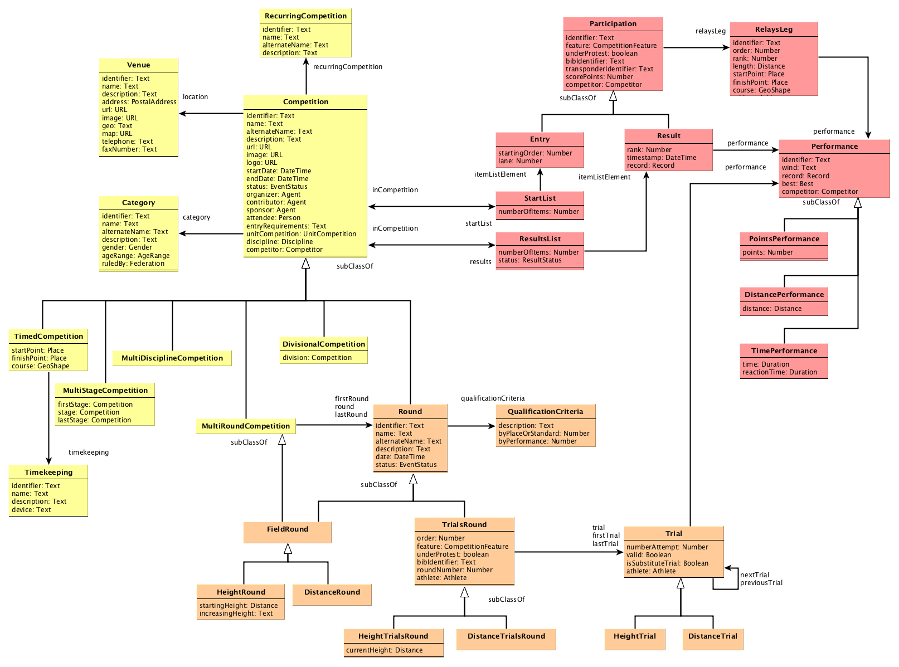

**Schedule and venues of Athletics events:**

* **[Athletics Competitions](#athletics-competitions)**. Organized occasion where Athletics events are planed and take place at a specific location during a period of time. Most Athletics events are part of a bigger meeting, or competition. These competions can be organized periodically ([Recurring Competitions](#recurring-competitions)), such as the Summer Olympic Games. These events may have of different nature, depending on the disciplines, schedule, competitors, and scope (e.g., championships tournaments, leagues, fundraising road races, etc.). Athletics competitions may divided in several [Competitions](#athletics-competitions) ([Divisional Competition](#divisional-competitions) such as [Summer Olympic Games](https://en.wikipedia.org/wiki/Athletics_at_the_Summer_Olympics) include 24 independent event disciplines for men and 23 for women); they may include several stages ([Multi Stage Competitions](#multi-stage-competitions) like the Diamond League); also competitions may be composed of several disciplines ([Multi Discipline Competitions](#multidiscipline-competitions) are combined events such as Decathlon).

* **[Venues](#venues)**. Location where events and competitions are held.

* **[Category](#category)**. Specific category of an event (e.g., Senior Men, U18 Women, etc.).

**Competition management:**

* **[Competition Rounds](#competition-rounds)**. Stages of Athletics competitions (e.g., Heats, Finals, etc.) where competitors are distributed in groups. Rounds depend on the competition rules for each discipline, so there is a difference between rounds within timed events, and rounds in field events. Vertical jumps have different rules regarding rounds in field events.  

* **[Timekeeping](#timekeeping)**. Method or system used for timekeeping in timed events.

* **[Participation](#participation)**. Stages within the process of taking part in an Athletics event, from entries in the **[Start List](#start-list)** to [Results](#results) after the competition. 
    * **[Start List](#start-list)**. Ordered set of competitors (athletes or teams) qualified to compete in a specific competition round. Start list contains information about competitors, the order of competition, and other competition information provided by judges. 
    * **[Results](#results)**. Ordered list of competitors with their **performances** after an event or a concrete round. It serves as ranking for each stage of the competition. Result list items will include information about the impact of the performance in the competition (i.e., records, disqualifications, competition 'under protest', etc.).

* **[Performances](#performances)**. Resulting competitor's accomplishment recognized by judges after a competition round. Measurements depend on the type of discipline (i.e., running performances are measured as time, jumps and throws are measured in centimetres). It may include information about the conditions in which competitor got the performance (e.g., wind speed). 

* **[Trials Rounds](#trials-rounds)**. Rounds of Field Events include one of several rounds of [Trials](#field-trials), where athletes have different attempts to achieve their best performance in the competition.  

* **[Field Trials](#field-trials)**. Each one of the attempts performed by athletes within a round of trials ([Trial Round](#trials-rounds)).  

**Competitors and affiliation:**

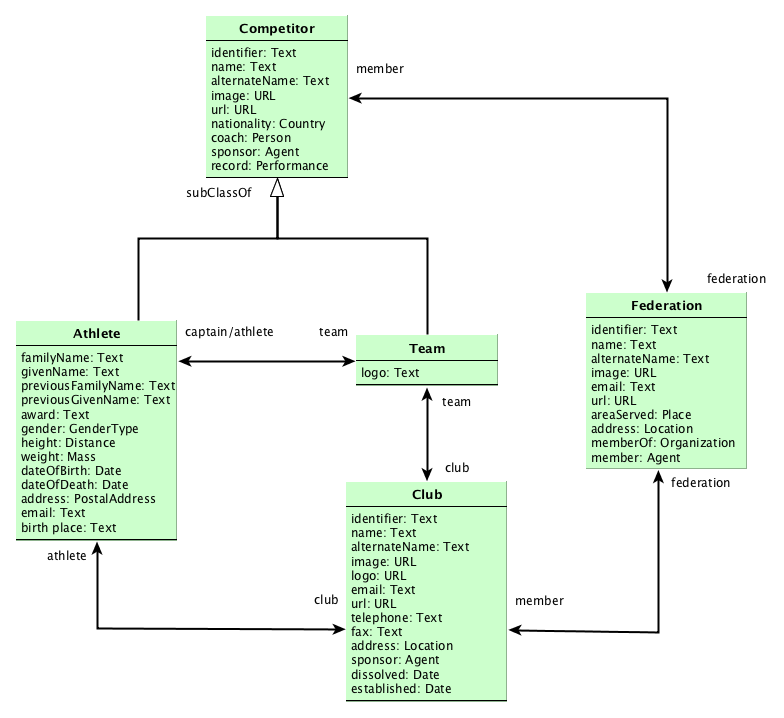

The UML diagram represents competitors: 

* **[Competitors](#competitors)**. **[Athletes](#athletes)** or **[Teams](#teams)** that takes part in Athletics events. Athletes are defined by gender, age, nationality, affiliation to club and/or federation, and other personal information. Both athletes and teams can be attached to [Clubs](#clubs) as organizations.

* **[Athletics Federations](#athletics-federations)**. Sports organizations in charge of governing and rule Athletics in specific territories. [Athletics Federations](#athletics-federations) may be attached to other higher-level federations. **[Athletes](#athletes)**, **[Teams](#teams)**, and **[Clubs](#clubs) may be attached to federations. 


## Schedule, Venues of Events

### Athletics Competitions

Events where Athletics competitions are planed and held. These competitions, that can be part of a [Recurring Competition](#recurring-competitions), take place at a specific location during a concrete period of time. Athletics events may include one or several [Athletics Competitions](#athletics-competitions) of different nature, depending on disciplines (e.g., 100m, marathon, pole vault, etc.), schedule (e.g. one-day meetings, World championships, etc.), competitors (e.g., U23, Masters, etc.), and scope (e.g., regional, national, supranational championships, leagues, etc.). Other amateur competitions such as fundraising road races or school races are also considered Athletics competitions.

_Examples of Athletics competitions are: [IAAF World Championships London 2017](http://www.iaafworldchampionships.com), [European Throwing Cup, 2017](http://www.european-athletics.org/competitions/european-throwing-cup/), [European Combined Events Team Championships Super League, Tallin 2017](http://www.european-athletics.org/competitions/european-combined-events-team-championships-super-league/), [USATF Cross Country Championships](http://www.usatf.org/Events---Calendar/2017/USATF-Cross-Country-Championships.aspx), and [Summer Olympic Games Rio 2016](https://www.olympic.org/rio-2016/athletics)._ 

Competitions may be described by the following attributes:

| Property | Description | Value Type |
|:-------- |:----------- |:---------- |
| identifier | Unique character string to identify the competition. | Text |
| name | Descriptive name of the competition. | Text |
| alternate name | An alias to name the competition. | Text |
| description | About the competition. | Text |
| location | Venue where the event is held (for instance, Berlin Olympic Stadium). | [Venue](#venues) or Text |
| url | Webpage URL about the event. | URL |
| image | Picture about the event. | URL |
| logo | Logo of the event. | URL |
| start date | Date and time when the event starts. | [Date and Time](#date,-time-and-periods) |
| end date | Date and time when the event ends. | [Date and Time](#date,-time-and-periods) |
| status | Status of the event (scheduled, completed, etc.) | [Event Status](#event-status) |
| organizer(s) | Person(s) or organization(s) that organizes the event. | [Person](#persons) or [Organization](#organizations) |
| contributor(s) | Person(s) or organization(s) that collaborates in the organization of the event. | [Person](#persons) or [Organization](#organizations) |
| sponsor(s) | Person(s) or organization(s) that sponsors the event. | [Person](#persons) or [Organization](#organizations) |
| attendee(s) | Person(s) who attends the event. | [Person](#persons) |
| recurring competition | Recurring competition related to this. | [Recurring Competition](#recurring-competitions) |
| discipline | Type of the Athletics event according to a defined taxonomy (e.g., `Outdoor Sprint Relays`). | [Disciplines](#disciplines) |
| category | The specific category for this event competition. | [Category](#category) |
| entry requirements | Requirements to take part in the event.  | Text |
| results | List with the results after the celebration of all rounds of the event.  | **[Results List](#results-lists)** |
| start list | List of competitors qualified to take part in competition. | **[Start List](#start-list)** |

Depending on the kind of competition and discipline, competitions may be of different types.

#### Multi Stage Competitions

A multi stage competition is an athletic event organised as a set of stages. 

_Examples of multi stage competition are: The Diamond League, and the Surrey Cross Country League._

| Property | Description | Value Type |
|:-------- |:----------- |:---------- |
| first stage | First stage of the multi stage competition. | [Athletics Competition](#athletics-competitions) |
| last stage | Last stage of the multi stage competition. | [Athletics Competition](#athletics-competitions) |
| stage | Stage of the multi stage competition. | [Athletics Competition](#athletics-competitions) |


#### Multi Round Competitions

A multi round competition is an athletic event organised as a sequence of qualification rounds.

_Examples of multi round competition are field events._

| Property | Description | Value Type |
|:-------- |:----------- |:---------- |
| first round | First round in the multi round competition. | [Competition Rounds](#competition-rounds) |
| last round | Last round in the multi round competition. | [Competition Rounds](#competition-rounds) |
| round | Round in the multi round competition. | [Competition Rounds](#competition-rounds) |


#### Divisional Competitions

A Divisional Competition is a competition that is divided into a number of competitions. 

_Examples of multi stage competition are: London Summer Olympic Games 2012, and European Championships 2016._

| Property | Description | Value Type |
|:-------- |:----------- |:---------- |
| division | Division of the competition. | [Athletics Competition](#athletics-competitions) |


#### Multidiscipline Competitions

A Multidiscipline Competition is a competition that incorporates a number of different event disciplines.

_Examples of multi stage competition are: London Summer Olympic Games 2012, and European Championships 2016._


#### Timed Competitions

A Timed Competition is a competition where performances are measured as time. Timed events have specific information about timekeeping. This kind of events may have information about the start/finish point and the course of the race.

| Property | Description | Value Type |
|:-------- |:----------- |:---------- |
| start point | Place where the competition starts.  | [Place] |
| finish point | Place where the competition finishes.  | [Place] |
| course | Track of the competition.  | [GeoShape] |
| timekeeping | Type of timekeeping used to control the competition.  | [Timekeeping](#timekeeping) |


#### Recurring Competitions

Athletics competitions that are held periodically, such as the Summer Olympic Games.

Recurring Competitions may be described by the following attributes:

| Property | Description | Value Type |
|:-------- |:----------- |:---------- |
| identifier | Unique character string to identify the recurring competition. | Text |
| name | Descriptive name of the recurring competition. | Text |
| alternate name | An alias to name the recurring competition. | Text |
| description | About the recurring competition. | Text |


_Example of competition model: 2016 European Championships, 100m Men._

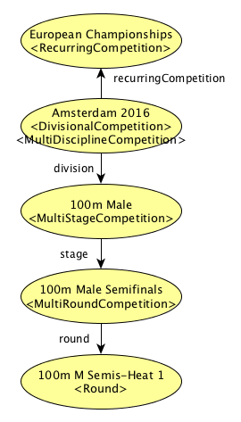

_Example of competition model: 2016 European Championships Heptathlon (simplified with only five combined events)._

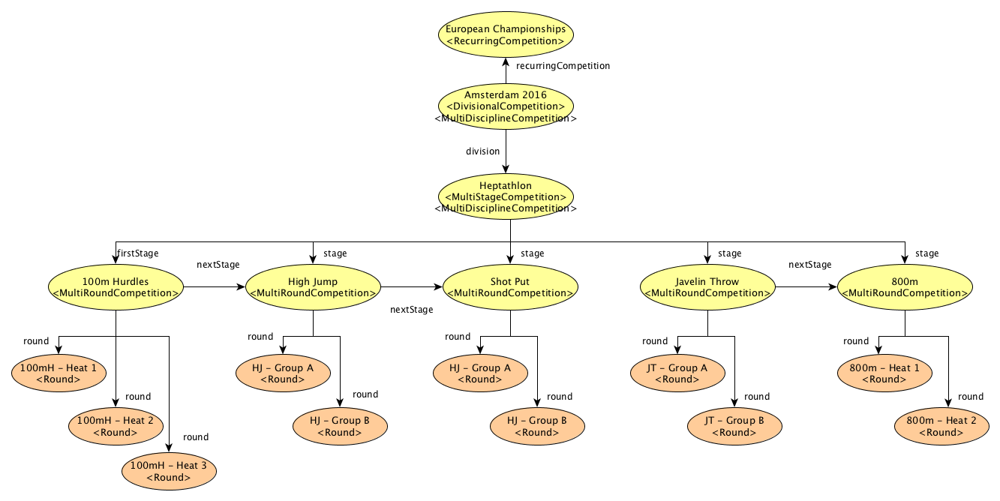


### Category

Division that marks the competition of athletes and teams in events. Categories may include gender, age range and specific rules depending of the event.  

_Examples of categories are: *M35* (Men aged 35-39), *U23* (Under 23) Men, or *ad hoc* categories for non-official competitions such as *teachers* and *parents* in school sports._     

Categories will be described by these following properties:

| Property | Description | Value Type |
|:-------- |:----------- |:---------- |
| identifier | Unique character string to identify the category. | Text |
| name | Name of the category (i.e., `Under 23 Men`, `Teachers`) | Text |
| alternate name | Alternate name of the category (i.e., `M35`, `W35`) | Text |
| description | Description and notes about the category. | Text |
| gender | Gender of athletes involved this category.  | [Competition Gender](#competition-gender) |
| age range | Athletes' range of age to be eligible for this category.  | [Age Range](#age-range) or Text |
| ruledBy | Federation that rules this specific category.  | [Federation](#federations) |


Example:
```
{
    "@type" :  "Category",
    "name" : "U18 Male",
    "description" : "Boys under 18",
    "gender" : "gender:Male",
    "ageRange" : "age:U18",
    "ruledBy" : "federation:IAAF"
}

```
[More use cases and examples](./examples).


There is a predefined list of [standard categories](#age-and-sex-categories).


### Venues

**Places** where events and competitions are held. Events may take part either in stadia (e.g., track and field events at Helsinki Olympic Stadium) or outside stadia (e.g., cross-country, mountain races, road races, etc.). 


Venues can be described by the following attributes:

| Property | Description | Value Type |
|:-------- |:----------- |:---------- |
| identifier | Unique character string to identify the venue. | Text |
| name | Descriptive name of the venue. | Text |
| description | Descriptive text about the place. | Text |
| address | Postal address related to the venue. | [Postal Address](#postal-addresses) or Text |
| url | Webpage URL about the venue. | URL |
| image | Picture about the venue. | URL |
| geo | Coordinates of the venue. | Text |
| map | URL to a map pointing to the venue. | URL |
| telephone(s) | Telephone number(s) of the venue. | Text |
| fax number | Fax number of the venue. | Text |
| type | Type of the venue. | **[Venue Type](#venue-type)** |

Example:
```
{
    "@id" : "http://example.com/venue:0001",
    "@type" : "Venue",                
    "name" : "Olympic Stadium Amsterdam",
    "geo" : 
        {
            "latitude" : "52.343417",
            "longitude" : "4.854192"
        },
    "map" : "http://example.org/map",
    "address" : "http://example.org/postaladdress:0001"
}
```
[More use cases and examples](./examples).


See [RunTrack Directory](http://www.runtrackdir.com/details.asp?track=london-nh)

### Postal Addresses

A postal address may be represented by some common properties:

| Property | Description | Value Type |
|:-------- |:----------- |:---------- |
| identifier | Unique character string to identify the postal address. | Text |
| name | Descriptive name of the place (e.g., Helsinki Olympic Stadium). | Text |
| street address | The street address (e.g., Paavo Nurmen tie 1).  | Text |
| locality | The locality (e.g., Helsinki). | Text |
| post office box number | The post office box number for PO box addresses. | Text |
| postal code | The postal code (e.g., 00250)| Text |
| country | The country (e.g., Finland). | [Country](#countries) |


Example:
```
{
    "@id" : "http://example.org/postaladdress:0001",
    "@type" : "PostalAddress",
    "streetAddress" : "Olympisch Stadion 2",
    "addressLocality" : "Amsterdam",
    "postalCode" : "1076 DE",
    "addressCountry" : "country:NL"
}
```
[More use cases and examples](./examples).


## Competition Management

### Competition Rounds

[Multi Stage Competitions](#multi-stage-competitions) are composed of several stages or rounds. Those stages in Athletics events can be also composed of different rounds (e.g., heats, finals, throwing trials) where competitors are distributed. Number and type of rounds depend on the competition rules for each discipline. For instance, track sprint competitions with many participants may have various heats at preliminary round, several heats at first round, two semifinals, and a final.

Competition rounds aims at qualifying athletes to next round until the final. There are competitions that only have one final round such as Marathon or Cross Country races.

_Examples of Competition rounds are: 110m Hurdles Men **Preliminary Round Heat 1**, 10,000m Men **Final**, and 110 Hurdles Man **Semifinal 1**._  

Rounds in **Field events** include [Trials Rounds](#trials-rounds), where each athlete have several attempts to achieve the best performance. Depending on the discipline and the number of competitors, the number of trials varies. Athletes will be credited with their best valid performances after the rounds of trials. 

Rounds are competitions that may be described also by the following properties:

| Property | Description | Value Type |
|:-------- |:----------- |:---------- |
| qualification criteria | Details what a competitor has to do to get to the next round. | [Qualification Criteria](#qualification-criteria) |

#### Qualification Criteria

Requirements for the competitor to pass the round. Qualification may be based on the *finishing position* or by *best time*.

| Property | Description | Value Type |
|:-------- |:----------- |:---------- |
| timekeeping | Type of time keeping used to control athletes' performances (manual, automatic, etc.).  | [Timekeeping](#timekeeping) |
| description | Descriptive text of the qualification criteria. | Text |
| byPlaceOrStandard | Number of competitors that are qualified in a round by rank (track events) or standard (field events). | Text |
| byPerformance | Number of competitors that are qualified in a round by best performance. | Text |

Example:
```
{ 
    "@type" : "QualificationCriteria",
    "description" : "First 3 in each heat (Q) and 2 best performers (q) advance to the Final",
    "byPlaceOrStandard" : 3,
    "byPerformance" : 2
}
```

##### Timekeeping

There are three alternative methods of timekeeping, recognised as official by IAAF:
- **Hand Timing** (`HT`) – Hand Timing is usually given to 0.1 seconds (average the different timekeepers and rounded up);
- **Fully Automatic Timing** (`FAT`), obtained from a Photo Finish System (FAT usually given to 0.01 seconds);
- **Transponder System Timing**. Automatic timing provided by radio signal devices. Road races use a variety of chip timing systems, precision is less important than recording thousands of people easily in the right order. 

Sometimes may be of interest gathering and representing information about devices and the specific conditions of timekeeping. Thus, timekeeping is represented by the following properties:

| Property | Description | Value Type |
|:-------- |:----------- |:---------- |
| identifier | Unique character string to identify the timekeeping method. | Text |
| name | Name of the method used for timekeeping (i.e., `Hand Timing`, `Fully Automatic` or `Transponder System Timing`) | Text |
| description | Description and notes about the method used for timekeeping. | Text |
| device | Brand, model and features of the device/system used for timekeeping. | Text |

Example:
```
{
    "@id" :  "http://example.com/timekeeping:0001",
    "@type" :  "Timekeeping",
    "name" : "Transponder Based System",
    "description" : "Fully automatic timekeeping system based on RFID transponders",
    "device" : "RFID System – Brand and model"
}
```
[More use cases and examples](./examples).


_Example of model for competition rounds at 100m Men - European Championships:_


#### Field Events Rounds

Competition in field events has a specific structure based on rounds of trials. Field Events are subclasses of [Round](#competition-rounds)  and [Multi Round Competitions](#multi-round-competitions). 


Field rounds and trails highlighted on a control card for Distance Field Events:
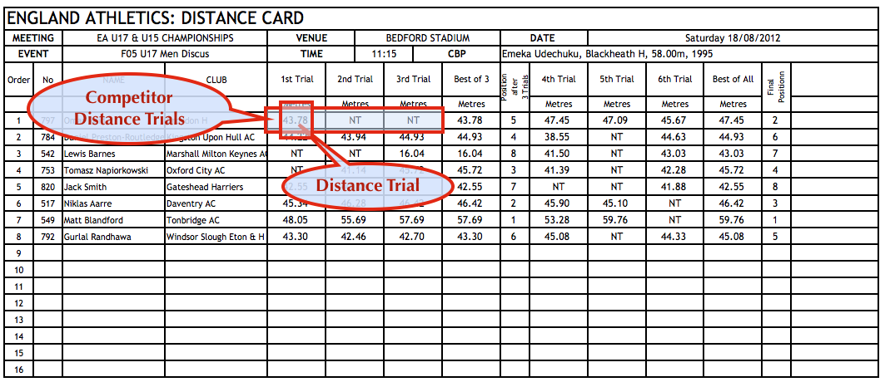


| Property | Description | Value Type |
|:-------- |:----------- |:---------- |
| trials rounds(s) | Rounds of trials corresponding to a field event. | [Trials Round](#trials-rounds) |


_Example of representation of the previous example of Javelin Throw Competition:_
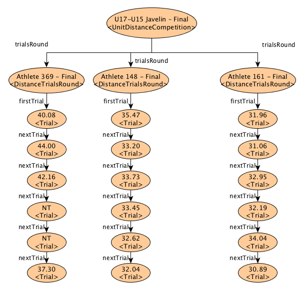


##### Vertical Jumps Rounds

Field rounds and trails highlighted on a control card for Vertical Jumps Events:
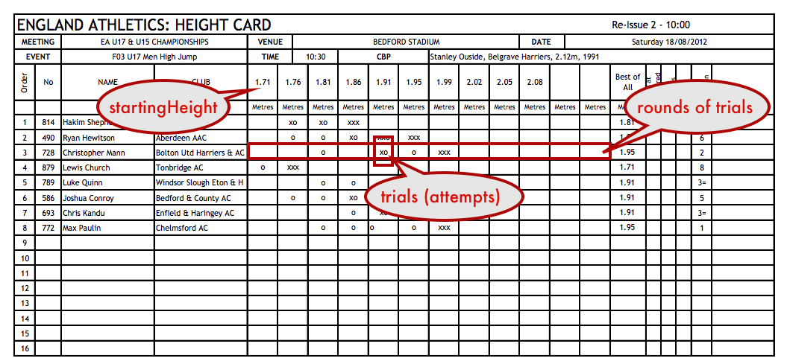


Rounds in Vertical Jumps include also specific information about height of the bar.

| Property | Description | Value Type |
|:-------- |:----------- |:---------- |
| starting height | (Vertical jumps) The starting height the bar is raised at the start of the round. | [Distance](#distance) |
| increasing height | (Vertical jumps) The subsequent heights to which the bar will be raised at the end of each round of trials. | Text |


_Example of model of rounds for the distance card shown in the previous example (High Jump):_
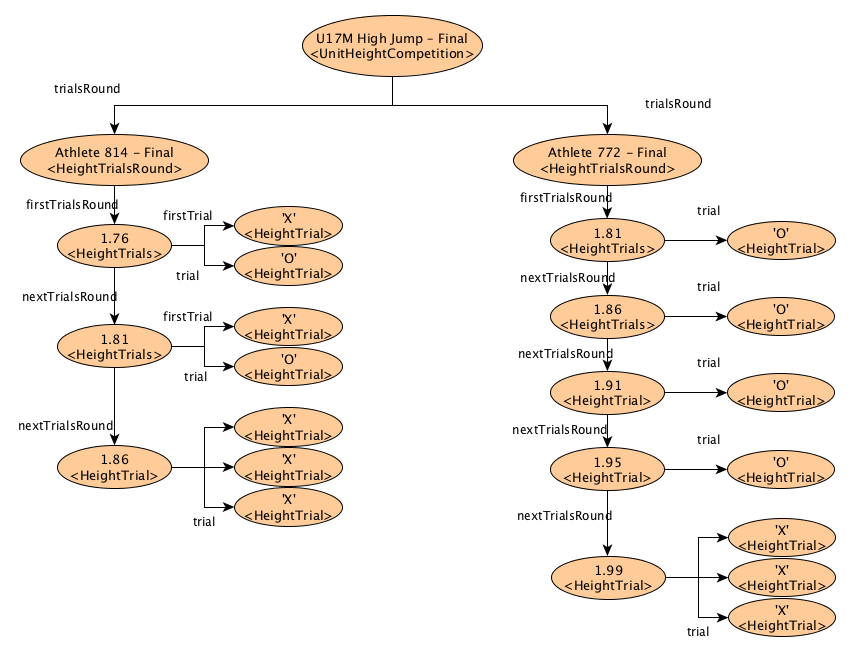


### Trials Rounds

**Field events** rounds are composed of **rounds of trials** that are performed by each athlete. 

| Property | Description | Value Type |
|:-------- |:----------- |:---------- |
| identifier | Unique character string to identify the round of trials. | Text |
| athlete | Athlete competing in this round of trials. | [Athlete](#athletes) or [Team](#teams) |
| feature(s) | Set of features and notes included by officials for this round of trials  (e.g., 'Qualified without standard in field events', 'Advanced to next round by Referee') | **[Start Lists and Results](#start-lists-and-results)** |
| under protest | Flag indicating the competitor will take part in the round of trials. | Boolean |
| bib identifier | Text or number identifying the competitor, printed on the bib. | Text |
| transponder identifier | (Timed events) Text or code identifying the competitor by a transponder. | Text |
| order | Competitor's order in the start list of this round. | Number |
| score points | Score points accumulated by the competitor at the start of the round in case of Combined Events such as Decathlon and Heptathlon. | Number |
| round number | Number of the round of trials. | Number |
| trial(s) | Athlete's attempt in this round of trials. | [Field Trial](#field-trials) |


#### Vertical Jumps Trials Rounds

In **Vertical Jumps** the **rounds of trials** include the height the athlete is attempting. 

| Property | Description | Value Type |
|:-------- |:----------- |:---------- |
| current height | The target height the bar is raised for this round. | [Distance](#distance) |


### Field Trials

**Field events** are composed of **rounds of trials**, where the number of trials is variable. Except for Vertical Jumps, each competitor only will have no more than one trial recorded in any one round of trials of the competition. Anyway, all trials belonging to rounds of trials will have the same structure, independently of the discipline.

Except in Vertical Jumps, a valid trial shall be indicated by the measurement taken. For the standard abbreviations and symbols to be used in all other cases see [Start lists and results](#Start lists and results). A *´substitute´* trial is given in case an athlete is hampered in a trial or it cannot be correctly recorded.

Trials may be described by the following properties:

| Property | Description | Value Type |
|:-------- |:----------- |:---------- |
| identifier | Unique character string to identify the trial. | Text |
| athlete | Athlete or team competing in this trials. | [Athlete](#athletes) or [Team](#teams) |
| feature(s) | Set of features and notes included by officials for this attempt  (e.g., 'Qualified without standard in field events', 'Advanced to next round by Referee') | **[Start Lists and Results](#start-lists-and-results)** |
| under protest | Flag indicating the competitor will take part in the round of trials. | Boolean |
| bib identifier | Text or number identifying the competitor, printed on the bib. | Text |
| attempt | Number indicating the correlative number of the attempt. | Number |
| performance | Performance achieved in case the trial was valid. | [Performance](#performances) |
| valid | Flag indicating if the trial was valid or not (failure) | Boolean |
| isSubstitute | Flag indicating if the trial is a *substitute* trial. | Boolean |

Examples:
```
{
    "@id" : "http://example.com/trial:HJ11",
    "@type" : "Trial",
    "numberAttempt" : 1,
    "feature" : "feature:Failed",
    "valid" : false
}

{
    "@id" : "http://example.com/trial:HJ12",
    "@type" : "Trial",
    "numberAttempt" : 2,
    "valid" : true,
    "feature" : "feature:PassedTrial",
    "performance" : "http://example.com/performance:34354"
}

```
[More use cases and examples](./examples).


### Participation

This entity models stages of the process of athletes taking part in events, from entries in [Start Lists](#start-lists) to [Results](#results).

Participation of athletes may be described by the following properties:

| Property | Description | Value Type |
|:-------- |:----------- |:---------- |
| identifier | Unique character string to identify the entry in the list. | Text |
| competitor | Athlete or team competing in this round. | [Athlete](#athletes) or [Team](#teams) |
| feature(s) | Set of features and notes included by officials in the starting list (e.g., 'Qualified without standard in field events', 'Advanced to next round by Referee') | **[Start Lists and Results](#start-lists-and-results)** |
| under protest | Flag indicating the competitor will take part in the round and/or heat competing 'under protest'. | Boolean |
| bib identifier | Text or number identifying the competitor, printed on the bib. | Text |
| transponder identifier | Text or code identifying the competitor by a transponder. | Text |
| score points | Score points accumulated by the competitor at the start of the round and/or heat, in case of Combined Events such as Decathlon and Heptathlon. | Number |
| relays legs | List of consecutive legs in the case of a relays event. | [Relays Legs](#relays-legs) |


#### Start Lists

Rounds of competitions have **start lists**. These lists are provided by officials and include an ordered set of competitors (athletes or teams) qualified to compete in the related heat or round. 

In either a track or field  event, if an athlete makes an immediate oral protest against having been charged with a false start or a failure trial, the athlete may continue competing `under protest`.

_Example of start list of Final round in 100m Women event:_
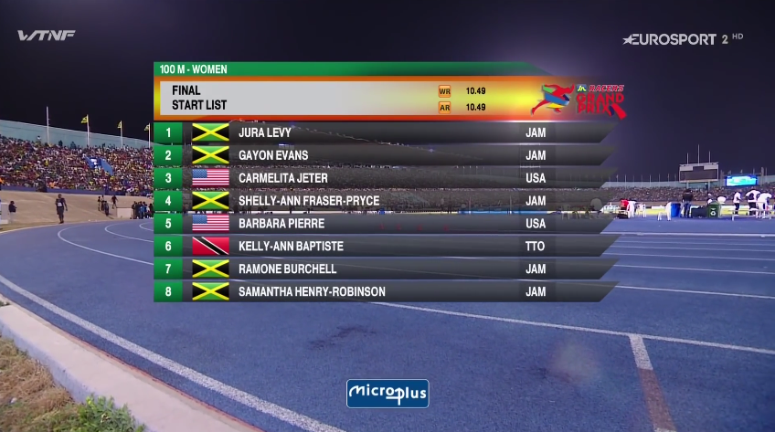

Each *Entry* of the [Start List](#start-lists) may include the following properties:

| Property | Description | Value Type |
|:-------- |:----------- |:---------- |
| identifier | Unique character string to identify the entry in the list. | Text |
| competitor | Athlete or team competing in this round. | [Athlete](#athletes) or [Team](#teams) |
| feature(s) | Set of features and notes included by officials in the starting list (e.g., 'Qualified without standard in field events', 'Advanced to next round by Referee') | **[Start Lists and Results](#start-lists-and-results)** |
| under protest | Flag indicating the competitor will take part in the round and/or heat competing 'under protest'. | Boolean |
| bib identifier | Text or number identifying the competitor, printed on the bib. | Text |
| transponder identifier | Text or code identifying the competitor by a transponder. | Text |
| score points | Score points accumulated by the competitor at the start of the round and/or heat, in case of Combined Events such as Decathlon and Heptathlon. | Number |
| startingOrder | Competitor's order in the start list. | Number |
| lane | Track lane number assigned to the competitor in case of certain track disciplines. | Number |
| relays legs | List of consecutive legs in the case of a team relays event. | [Relays Legs](#relays-legs) |
| in competition | Competition related to this start list. | [Athletics Competition](#athletics-competitions) |


Example:
```
{
    "@id" : "http://example.org/entry:000211",
    "@type" : "Entry",
    "order" : "1",
    "bibIdentifier" : "1",
    "transponderIdentifier" : "1",
    "lane" : 2,
    "competitor" : "http://example.com/athlete:29383"
}
```
[More use cases and examples](./examples).


#### Results

'Results' is an ordered list collecting the performances achieved by competitors after a concrete round or at the end of the event. It serves as ranking for each stage of the competition. Result list items will include information about the impact of the performance in the competition (i.e., records, disqualifications, competition 'under protest', etc.). 

In Combined Events, scores are calculated according to *Combined events scoring tables*.

_Example of results after the Final round in 100m Women event:_

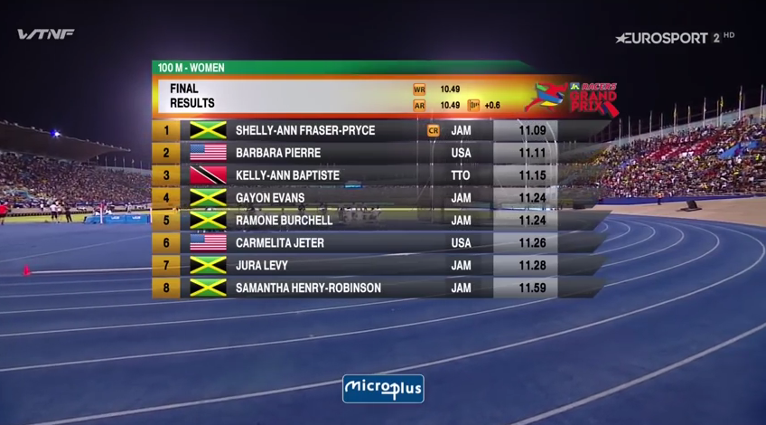

_Results of a timed competition for National teams:_

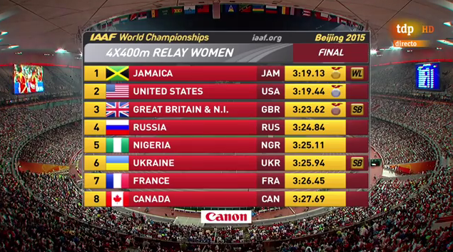

_Results of a field competition:_

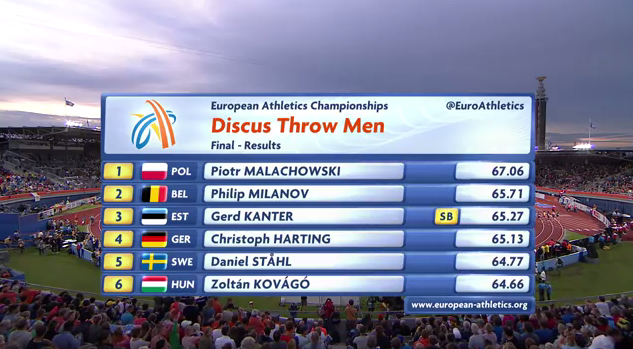

Each entry of the results list may include the following properties:

| Property | Description | Value Type |
|:-------- |:----------- |:---------- |
| identifier | Unique character string to identify the entry in the list. | Text |
| competitor | Athlete or team competing in this round. | [Athlete](#athletes) or [Team](#teams) |
| feature(s) | Set of features and notes included by officials in the starting list (e.g., 'Qualified without standard in field events', 'Advanced to next round by Referee') | **[Start Lists and Results](#start-lists-and-results)** |
| under protest | Flag indicating the competitor will take part in the round and/or heat competing 'under protest'. | Boolean |
| bib identifier | Text or number identifying the competitor, printed on the bib. | Text |
| transponder identifier | Text or code identifying the competitor by a transponder. | Text |
| score points | Score points earned by the competitor in a specific round and/or heat in case of Combined Events (i.e., Decathlon, Heptathlon) and other team competitions (e.g. team competitions using score age grading). | Number |
| record(s) | Flags indicating records achieved after the competition round (e.g., World Record, National Record, etc.). | [Record](#records) |
| timestamp | Exact date and time when the results were produced. | [Date and Time](#date,-time-and-periods) |
| performance | Measure to quantify the performance of the competitor after the round and/or heat.  | **[Performance](#performances)** |
| relays legs | List of consecutive legs in the case of a team relays event with individual results. | [Relays Legs](#relays-legs) |
| status | Status of results. | [Result Status](#result-status) |
| in competition | Competition related to the results. | [Athletics Competition](#athletics-competitions) |

Example:
```
{
    "@id" : "http://example.com/result:234534",
    "rank" : "1",
    "bibIdentifier" : "13",
    "scorePoints" : 4587,
    "competitor" : "http://example.com/athlete:29384",
    "timestamp" : "2016-10-15T10:31:12+01:00",
    "performance" : "http://example.com/performance:032410"
}
```
[More use cases and examples](./examples).


### Performances

Performance represent the resulting competitor's accomplishment measured and recognized by officials after a competition round/heat. Measurements depend on the type of discipline (i.e., running performances are measured as time, jumps and throws are measured in centimetres). It may include information about the conditions in which competitor got the performance (e.g., wind assistance).

_Using the previous example of result list, Shelly-Ann Fraser-Pryce's performance is: **11.09 (seconds), +0.6 (m/s wind assistance), setting a new CR record** at 100m Women Final._  


| Property | Description | Value Type |
|:-------- |:----------- |:---------- |
| identifier | Unique character string to identify the performance univocally. | Text |
| wind assistance | Wind speed at the moment of registering the performance (it could be either positive or negative). | Text |
| record(s) | Flags indicating records achieved after the competition round (e.g., World Record, National Record, etc.). | [Record](#records) |
| best(s) | Flags indicating bests achieved after the competition round (e.g., Personal Best, Season Leader, etc.). | [Best](#bests) |


There are different types of performance depending on the type of event: **Timed** events with results measured as time; **Lenght** events, measured as distance (Throws, Long Jump and Triple Jump); **Height** events, measured as height (Vertical Jumps); and **Combined** events, measured as score points (Decathlon, Heptathlon, etc.). So, this kind of performances are described by the following sub-classes:

#### Timed Performance

Apart from all properties of the parent class `Perfomance`, this entity includes:

| Property | Description | Value Type |
|:-------- |:----------- |:---------- |
| time | Official measure of the performance expressed as time. | [Date and Time](#date,-time-and-periods) |
| reaction time | Reaction time of the athlete during a sprint event. | [Date and Time](#date,-time-and-periods) |

Example:
```
// 11.21 seconds
// 12 milliseconds
{
    "time" : "T00:00:11.21",
    "reactionTime" : "T00:00:00.012"
}                                        
```

#### Combined Performance

Apart from all properties of the parent class `Perfomance`, this entity includes:

| Property | Description | Value Type |
|:-------- |:----------- |:---------- |
| points | Official measure of the performance expressed as score points. | Number |

Example:
```
{
    "points" : 18273
}                                        
```

#### Length Performance

Apart from all properties of the parent class `Perfomance`, this entity includes:

| Property | Description | Value Type |
|:-------- |:----------- |:---------- |
| points | Official measure of the performance expressed as distance. | [Distance](#distance) |

Example:
```
{
    "distance" : "56 m"
}                                        
```

#### Height Performance

Apart from all properties of the parent class `Perfomance`, this entity includes:

| Property | Description | Value Type |
|:-------- |:----------- |:---------- |
| height | Official measure of the performance expressed as vertical distance. | [Distance](#distance) |

Example:
```
{
    "height" : "2.14 m"
}                                        
```

### Relays Legs

Relays events are competitions between two or more [Teams](#teams) where [Athletes](#athletes) of each team does part of the race and then another member continues. So Teams' [Participation](#participation) may include two or more consecutive legs with independent performances that will aggregated for the overall team results.

_For instance, 4×400 metres relay is a discipline for teams of four runners, who each complete a leg of 400 metres._

Legs are defined by the following properties:

| Property | Description | Value Type |
|:-------- |:----------- |:---------- |
| identifier | Unique character string to identify the relays leg. | Text |
| order | Order of this leg in the relays event. | Number |
| rank | Position achieved by the athlete after the leg. | Number |
| length | Length of the leg to be covered by the athlete. | [Distance](#distance) |
| start point | Place where the leg starts. | Place |
| finish point | Place where the leg finishes. | Place |
| course | Track (polygon) where the leg is held. | GeoShape |
| athlete | Person competing in this event. | [Athlete](#athletes) |
| performance | Measure to quantify the performance of the athlete after the leg.  | **[Performance](#performances)** |

Example:
```
{
    "@type" : "RelaysLeg",
    "order" : 1,
    "athlete" : "http://example.com/athlete:09822",
    "length" : "400m",
    "rank" : 1, 
    "performance" : 
        {
           "time": "51.56"
        }
}
```
[More use cases and examples](./examples).


## Competitors and Affiliation

Competitor is an agent that takes part in Athletics events. Depending on the type of event, either for individuals or for teams, agent is either an **[Athlete](#athletes)** or a **[Team](#teams)**, respectively. 

### Athletes

Athletes are **[Persons](#persons)** who participate in Athletics events. Athletes may be described using the following attributes:

| Property | Description | Value Type |
|:-------- |:----------- |:---------- |
| identifier | Unique character string to identify the person as athlete. | Text |
| name | Athlete's full name. | Text |
| family name | Athlete's family name; surname. | Text |
| given name | Athlete's given name; first name. | Text |
| previous family name | Athlete's family name; surname. | Text |
| previous given name | Athlete's given name; first name. | Text |
| alternate name | An alias to name the athlete. | Text |
| address | Main residence address of the athlete. | [Postal Address](#postal-addresses) or Text |
| image | Picture of the athlete. | URL |
| email | Email address. | Text |
| url | Webpage URL about the athlete. | URL |
| gender | Athlete's gender. | [Gender](#gender) |
| height | Athlete's height. | [Distance](#distance) |
| weight | Athlete's weight. | [Mass](#mass) |
| nationality | Athlete's nationality. | [Country](#countries) |
| date of birth | Date of birth. | [Date and Time](#date,-time-and-periods) |
| date of death | Date of death. | [Date and Time](#date,-time-and-periods) |
| date of death | Date of death. | [Date and Time](#date,-time-and-periods) |
| birth place | Locality and country of birt (e.g. "Tallinn, Estonia") | Text |
| federation(s) | Federation(s) which the athlete is attached to. | [Athletics Federation](#athletics-federations) |
| coach(es) | Athlete's main coach(es). | [Person](#persons) |
| sponsor(s) | Athlete's sponsor(s). | [Person](#persons) or [Organization](#organizations) |
| club(s) | Club(s) which the athlete is affiliated to. | **[Club](#club)** |
| team(s) | Team(s) which the athlete is part of (for instance, a National Team). | **[Team](#teams)** |
| best(s) | Athlete's best performances. | [Best](#bests) |  


Example:
```
{
    "@id" : "http://example.com/athlete:000021", 
    "@type" : "Athlete",
    "name" : "Mohamed Muktar Jama Farah",
    "familyName" : "Farah",
    "givenName" : "Mohamed Muktar Jama",
    "alternateName" : "Mo Farah",                // How they are known
    "url" : "http://www.mofarah.com",
    "gender" : "gender:Male" ,
    "image" : "https://example.com/260px-MoPodiumRio2016.png",
    "nationality" : "country:UK",                       
    "email" : "fakeemail@example.com",
    "height" : "175 cm",
    "weight" : "65 Kg",   
    "birthPlace" : "Mogadishu, Somalia" ,
    "birthDate" : "1983-04-23",             
    "address" : "http://example.org/postaladdress:00002",
    "coach" : 
        { 
            "@type" : "Person",
            "name" : "Alberto Salazar" 
        },
    "sponsor" : 
        {
            "@type" : "Organization",
            "name" : "Nike Oregon Project",
            "url" : "https://nikeoregonproject.com"            
        },
    "club" :                                  // Zero or more clubs
        [ 
           "http://example.com/club:NEB",
           "http://example.com/club:NOP"
        ],
    "federation" :
        [ 
           "http://example.com/federation:England_Athletics", 
           "http://example.com/federation:USATF" 
        ],
    "bests" :                                 // Lists to best performances
        [
           "http://example.com/performance:0000122",
           "http://example.com/performance:0000124",
           "http://example.com/performance:0002122",
           "http://example.com/performance:0000234"
            // … and so on 
        ]
}
```
[More use cases and examples](./examples).

### Clubs

An [Organization](#organizations) for [Athletes](#athletes). Clubs can create different [Teams](#teams) for specific competitions, such as leagues, relays, etc.  

Clubs may be described using the following attributes:

| Property | Description | Value Type |
|:-------- |:----------- |:---------- |
| identifier | Unique character string to identify the club. | Text |
| name | Descriptive name of the club. | Text |
| alternate name | An alias to name the club. | Text |
| address | Main postal address where the club is registered or located. | [Postal Address](#postal-addresses) or Text |
| image | Picture of the club. | URL |
| logo | Logo or flag of the club. | URL |
| email | Main email address of the club. | Text |
| telephone | Telephone number(s) of the club | Text |
| fax | Fax number(s) of the club | Text |
| url | Club homepage URL. | URL |
| nationality | Club's nationality. | [Country](#countries) |
| dissolved | Date (and time) when the team was dissolved. | [Date and Time](#date,-time-and-periods) |
| established | Date (and time) when the team was established. | [Date and Time](#date,-time-and-periods) |
| federation(s) | Federation(s) which the club is attached to. | [Athletics Federation](#athletics-federations) |
| sponsor(s) | Sponsor(s) of the club. | [Person](#persons) or [Organization](#organizations) |
| team(s) | Teams(s) attached to this club. | **[Team](#teams)** |

Example:
```
{
    "@id" : "http://example.com/club:NEB",
    "@type" : "Club",
    "name" : "Newham & Essex Beagles",
    "alternateName" : "BeaglesAC",                       // Alias, acronym, etc.
    "url" : "http://www.newhamandessexbeagles.co.uk/",
    "image" : "http://example.org/image.png",
    "logo" : "http://example.org/logo.png",               // Logo, flag, etc.
    "telephone" : "(+44) 020 7511 6463",                  
    "fax" : "(+44) 020 7511 4477",
    "email" : "fakeemail@example.org",
    "address" : "http://example.org/postaladdress:0004",
    "sponsor" : "Asics",
    "athlete" :                                           // List of athletes affiliated to the club
        [
           "http://example.com/athlete:082838",
           "http://example.com/athlete:082839",
           "http://example.com/athlete:082840"
            // … and so on
        ],
    
    "memberOf" :"http://example.com/federation:England_Athletics"
}
```
[More use cases and examples](./examples).


### Teams

In certain events, such as relay races, competitors are groups of athletes or teams. These teams could be clubs, national teams, or just a joint of several athletes. 

Teams may be described using the following attributes:

| Property | Description | Value Type |
|:-------- |:----------- |:---------- |
| identifier | Unique character string to identify the team. | Text |
| name | Descriptive name of the team. | Text |
| alternate name | An alias to name the team. | Text |
| address | Main postal address where the team is registered or located. | [Postal Address](#postal-addresses) or Text |
| image | Picture of the team. | URL |
| logo | Logo or flag of the team. | URL |
| url | Webpage URL about the team. | URL |
| federation(s) | Federation(s) which the team is attached to. | [Athletics Federation](#athletics-federations) |
| nationality | Teams's nationality. | [Country](#countries) |
| sponsor(s) | Sponsor(s) of the team. | [Person](#persons) or [Organization](#organizations) |
| captain(s) | Athlete(s) who represents the team. | **[Athlete](#athletes)** |
| coach(es) | Person(s) who acts as coach for the team. | **[Person](#persons)** |
| best(s) | Best performances of the team (e.g., relay competitions). | [Best](#bests) |  
| athlete(s) | Athlete(s) affiliated to the team. | **[Athlete](#athletes)** |


_Example of definition of a national team as competitor in a 4x100:_
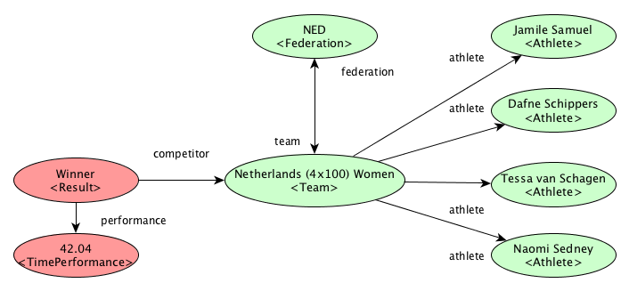

_Example of definition of a club forming a team for Ekiden:_
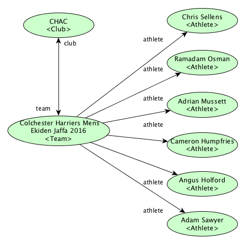


Examples:
```
{
    "@id" : "http://example.com/team:KEN001",
    "@type" : "Team",
    "name" : "Kent Athletic Club – Cross Country 2017 Team",
    "alternateName" : "KEN",                              // Alias, acronym, etc.
    "image" : "http://example.org/image.png",
    "logo" : "http://example.org/logo.png",               // Logo, flag, etc.
    "captain" : "http://example.com/athlete:092838",
    "athlete" :                                           // List of athletes composing the team
        [
           "http://example.com/athlete:092838",
           "http://example.com/athlete:092839",
           "http://example.com/athlete:092840"
            // … and so on
        ],
    "club" : "http://example.com/club:KEN"
}

//
// Example of National Team
//
{
    "@id" : "http://example.com/team:JAP2017",
    "@type" : "Team",
    "name" : "Japan Team - Marathon 2017",
    "alternateName" : "JAP",
    "image" : "http://example.org/image.png",
    "logo" : "http://example.org/logo.png",               // Logo, flag, etc.
    "captain" : "http://example.com/athlete:122838",
    "athlete" :                                           // List of athletes composing the team
        [
           "http://example.com/athlete:122838",
           "http://example.com/athlete:122839",
           "http://example.com/athlete:122840"
            // … and so on
        ],
    "federation" : "http://example.com/federation:JAP"
}
```
[More use cases and examples](./examples).


### Athletics Federations

Federation is a special type of organization in charge of governing and rule the sport of athletics. Federations may be attached to other higher-level federations.

Federations will have the properties of [Organizations](#organizations), adding the following:

| Property | Description | Value Type |
|:-------- |:----------- |:---------- |
| spatial | Spatial coverage of the federation, usually one or more administrative areas (city, region, country, etc.) | [Territory and Country](#territories-and-countries) | 
| member of | Higher-level federation(s) to which this federation is attached. | [Athletics Federation](#athletics-federations) | 
| member(s) | Lower level organization(s) attached to this federation. | [Organization](#organization) | 

Example:
```
{
    "@id" : "http://example.com/federation:England_Athletics",
    "@type" : "Federation",
    "name" : "England Athletics",
    "email" : "ea@example.com",
    "faxNumber" : "(+44) 0121 347 65439",
    "telephone" : "(+44) 0121 347 65423",
    "address" : "http://example.org/postaladdress:00012",
    "memberOf" : "http://example.com/federation:UK",    // Member of Federation
    "member" :                                          // Members attached to this federation
        [
           "http://example.com/club:NEB",
           "http://example.com/club:THH"
            
        ]
}
```
[More use cases and examples](./examples).


### Persons

Person is a basic entity to represent any person (i.e., athlete, coach, organizer, etc.). 

There are some properties that will be used commonly to represent people:

| Property | Description | Value Type |
|:-------- |:----------- |:---------- |
| identifier | Unique character string to identify the person. | Text |
| name | Person's full name. | Text |
| family name | Person's family name; surname. | Text |
| given name | Person's given name; first name. | Text |
| alternate name | An alias to name the person. | Text |
| address | Main residence address. | [Postal Address](#postal-addresses) or Text |
| image | Picture of the person. | URL |
| email | Email address. | Text |
| url | Webpage URL about him/her. | URL |

Example:
```
{ 
    "@type" : "Person",
    "name" : "Alberto Salazar" 
}
```
[More use cases and examples](./examples).


### Organizations

This entity may represent any type of organization (i.e., private company, public body, association, etc.). 

Organizations can be represented by the following properties:

| Property | Description | Value Type |
|:-------- |:----------- |:---------- |
| identifier | Unique character string to identify the organization. | Text |
| name | Organization name. | Text |
| alternate name | An alias to name the organization. | Text |
| address | Postal address where the organization is located. | [Postal Address](#postal-addresses) or Text |
| logo | Logo of the organization. | URL |
| email | Main email address. | Text |
| url | Webpage URL about the organization. | URL |
| telephone(s) | Main telephone number(s) of the organization. | Text |

Example:
```
{
    "@type" : "Organization",
    "name" : "Nike Oregon Project",
    "url" : "https://nikeoregonproject.com"            
}
```
[More use cases and examples](./examples).


*******


## Classification schemas and data types 

Most of the following definitions and values for this set of value schemas are extracted from the official [Technical Competition Rules](https://www.iaaf.org/about-iaaf/documents/rules-regulations) published by IAAF.


### Date, Time and Periods

Dates and time will be represented using the [ISO 8601](https://en.wikipedia.org/wiki/ISO_8601) standard. 

Examples:
* Time (`[hh][mm][ss].sss` or `[hh]:[mm]:[ss].sss`): `04:45:38.000` (it can include the timezone `<time>±[hh]:[mm]`)
* Date (`[YYYY][MM][DD]` or `[YYYY]-[MM]-[DD]`): 2017-04-07
* Date and Time (`<date>T<time>`): `2017-04-07T04:45:38.000+00:00` 


### Distance

Measurements of the form `<Number> <Length-unit-of-measure>` (e.g., `7 ft`).

### Mass

Measurements of the form `<Number> <Mass-unit-of-measure>` (e.g., `75.3 kg`).


### Gender

Enumeration of genders with two values: 

| Code | Gender Type |
| ---- | ----------- |
| `Male` | Men and/or boys. |
| `Female` | Women and/or girls. |


### Competition Gender

Enumeration of genders with two values: 

| Code | Gender Type |
| ---- | ----------- |
| `Male` | Men and/or boys. |
| `Female` | Women and/or girls. |
| `Mixed` | Both Male and Female. |

### Start Lists and Results

According to IAAF Rule 132.4, there are official standard abbreviations and symbols used in the preparation of start lists and results:

| Code | Issue/feature |
| ------------- | ---- |
| `DNS` | Did Not Start |
| `DNF` | Did Not Finish |
| `DQ` | Disqualified |
| `R` | Retired from competition |
| `Q` | Qualified by place (track) or standard (field) |
| `q` | Qualified by performance (time in timed events and rank in field events) |
| `qR` | Advanced to next round by Referee |
| `qJ` | Advanced to next round by Jury of Appeal |
| `>` | Bent knee (Race walking) |
| `~` | loss of contact (Race walking) |
| `yC` | yellow Card |
| `yRC` | Second yellow Card |
| `RC` | Red Card |
| `Fn` | False Start |
| `o` | Clearance (valid trial in Height Events) |
| `-` | Pass (passed trial in field events) |
| `x` | Failure (failed trial in field events) |
| `NM` | No Mark |
| `NH` | No Height |
| `h` | Hand-timing |
| `a` | automatic timing with no hundredths of a second measured |
| `A` | performance achieved at altitude |
| `OT` | Oversized Track |


### Age Range

According to IAFF RULE 141 (Age and Sex Categories), apart from [Gender](#gender) competition may also be divided into specific age group classifications (Under 18, Under 20, Senior). 

EA, NACAC and CONSUDALE recognises the **`U23`** age category for those athletes aged between 20-22. Athletes under this age range may take part in the competitions. Historically, NACAC used to had a **`U25`** category for those athletes under 25. 

WMA rules the case of *Master* categories for men and women. Thes categories affects to any athlete who has reached their 35th birthday. Masters go in 5 year bands (global standard set by WMA): V35, V40, V45 etc. It is commonly conflated with gender e.g. M45, W50.

Usually, for those categories officially recognized, participators in the competitions in these categories may be athletes who have not completed their nth birthday on the 31st December of the year the competition occurs. Eligibility dates may vary depending on specific rules, such as in the case of youth sports. 

Thus, the official *standard* age ranges are: 

| Age range | Age‐group ID |
| --------- | ----------------- |
| 16 - 17 | `U18` |
| 18 - 19 | `U20` |
| 20 - 22 | `U23` |
| 23 - 34 | `SEN` |
| 35 ‐ 39 | `V35` |
| 40 ‐ 44 | `V40` |
| 45 ‐ 49 | `V45` |
| 50 ‐ 54 | `V50` |
| 55 ‐ 59 | `V55` |
| 60 ‐ 64 | `V60` |
| 65 ‐ 69 | `V65` |
| 70 ‐ 74 | `V70` |
| 75 ‐ 79 | `V75` |
| 80 ‐ 84 | `V80` |
| 85 ‐ 89 | `V85` |
| 90 ‐ 94 | `V90` |
| 95 ‐ 99 | `V95` |
| 100+ | `V100` |

**Category** should be flexible to allow organizers to create virtual categories or adapt the *official* ones.


### Territories and countries

Athletics federations are autonomous bodies in control of Athletics at different levels, depending on the territory they cover. By its geographical area covered,  federations can be local (e.g., [19 Athletics federations for each region in Spain](http://www.rfea.es/web/federacion/mapaespana.asp)), national (e.g., [British Athletics](http://www.britishathletics.org.uk/governance/about-uka/)) and supranational (e.g. [Oceania Athletics](https://athletics-oceania.com)). Federations are usually attached to other federations hierarchically. 

See list of [IAAF Member Federations](./federations.md).


#### Countries

Countries may be represented by their [ISO 3166-1](https://en.wikipedia.org/wiki/ISO_3166-1) code (e.g., `ZW` for Zimbabwe, `ZA`for South Africa, `TG` for Togo).


#### Other territories

Territories may be local/regional. In this case, it should include the normalized country. 

### Event Status

Athletics events may have a property to represent the states that they may be in:

| Code | Status |
| ---- | ------ |
| `Unscheduled` | Competition is not confirmed. |
| `Scheduled` | Competition is scheduled. |
| `Postponed` | Competition will be postponed without being rescheduled yet. |
| `Rescheduled` | Competition is rescheduled. |
| `Delayed` | An event is held up, for example by inclement weather. Can happen before or during an event.
| `Scheduled Break` | Competition has a scheduled break (`intermission` in SportsML). |
| `Running` | Competition in progress (`mid-event` in SportsML). | 
| `Interrupted` | Competition interrupted once in progress (`halted` in SportsML). | 
| `Getting Ready` | The start of the competition is imminent |
| `Finished` | Competition is over and no more action will happen on the field of play (last competitor finished). (`post-event` in SportsML) |
| `Cancelled` | Competition will not take place (`suspended`, `canceled`, `discarded` in SportsML) |


### Records 

[Performances](#performances), if validated in competition [Results](#Results) can set records of different type:

| Code | Record Type |
| ---- | ----------- |
| `WR` | World Record |
| `=WR` | Equal World Record |
| `PR` | Paralympic Record |
| `AF` | African Record |
| `=AF` | Equal African Record |
| `AS` | Asian Record |
| `=AS` | Equal Asian Record |
| `ER` | European Record |
| `=ER` | Equal European Record |
| `AM` | American Record |
| `=AM` | Equal American Record |
| `OC` | Oceania Record |
| `=OC` | Equal Oceania Record |
| `AR` | Area (or continental) Record |
| `=AR` | Equal Area (or continental) Record |
| `NR` | National Record (for a specific country) |
| `=NR` | Equal National Record |
| `RR` | Regional Record |
| `=RR` | Equal Regional Record |
| `OR` | Olympic Record |
| `=OR` | Equal Olympic Record |
| `CR` | Championship Record |
| `=CR` | Equal Championship Record |
| `GR` | Games Record |
| `=GR` | Equal Games Record |
| `MR` | Meet Record |
| `=MR` | Equal Meet Record |
| `DLR` | Diamond League Record |
| `=DLR` | Equal Diamond League Record |
| `#` | indicates a record has not been accepted. The same mark is also used to indicate some sort of irregularity with a result. |
| `X` | indicates the athlete has been disqualified after the performance |
| `ClubR` | Club Record |

Records will be described by the type of record and the age-range category.

| Code | Record Type |
| ---- | ----------- |
| `AJR` | Area (or continental) Junior Record |
| `=AJR` | Equal Area (or continental) Junior Record |
| `EUR` | European U23 Record |
| `=EUR` | Equal European U23 Record |
| `WJR` | World Junior Record |
| `=WJR` | Equal World Junior Record |
| `EJR` | European Junior Record |
| `=EJR` | Equal European Junior Record |
| `NUR` | National U23 Record |
| `=NUR` | Equal National U23 Record |
| `NJR` | National Junior Record |
| `=NJR` | Equal National Junior Record |


### Bests 

The concept of 'best' refers to athlete's personal achievements, without setting official records with the [Performances](#performances).

| Code | Best Type |
| ---- | ----------- |
| `WYB` | World Youth Best (the best mark achieved by an athlete in the youth age category) |
| `=WYB` | Equal World Youth Best |
| `WB` | World Best (the best mark recorded for a non-IAAF world record event) |
| `=WB` | Equal World Best |
| `PB` | Personal Best (the best mark achieved by an athlete on a personal level) |
| `=PB` | Equal Personal Best |
| `SB` | Seasonal Best (the best mark achieved by an athlete on a personal level within a given season) |
| `=SB` | Equal Seasonal Best |
| `WL` | World Leader (the best mark achieved worldwide within a given season) |
| `=WL` | Equal World Lead |
| `EL` | European Lead |
| `=EL` | Equal European Lead |
| `EB` | European Best |
| `=EB` | Equal European Best |
| `CB` | Championship Best Performance |
| `=CB` | Equal Championship Best Performance |


### Disciplines

We can identify several categories for Athletics events, depending on gender, age, type of venue, distance and type of event (e.g., 100m Hurdles Women and 110m Hurdles Men). Although events rules may vary for the same type of discipline (i.e., differences of shot weight depending on gender and/or age).

See a [taxonomy of disciplines](./disciplines.md).

### Roles

Roles specified by IOC [ODF](http://odf.olympictech.org/2016-Rio/codes/HTML/common_codes/common_codes.htm). 

| Code | Role |
| ---- | ---- |
| `A` | Athlete |
| `C` | Coach |
| `G` | Guide (Paralympics only) |
| `J` | Judge |
| `S` | Technical Official (not Judge) |
| `T` | Team Official (not Coach) |


### Result Statuses

| Code | Status |
| ---- | ------ |
| `START_LIST` | Before competition, Start List	|
| `LIVE` | For live updates during competition |
| `INTERMEDIATE` | When competition is stopped, used at pre-defined points |
| `UNCONFIRMED` | When the unit is over but not yet unofficial or official.	Only used if other statuses do not come quickly.  |
| `UNOFFICIAL` | Results of the competition released as soon as the event is over, not waiting any official decision of the International Federation. The correctness of data must be assured.  |
| `OFFICIAL` | Results of the competition released as soon as the event is officially confirmed taking into account the resolution of the protests, etc.  |
| `PARTIAL` | Incomplete list, Final Ranking. |
| `PROTESTED` | After the competition is no longer LIVE and a protest has been lodged	After all decisions on the protest are made the ResultStatus will change to UNOFFICIAL or OFFICIAL as appropriate.  |


### Wind Units

| Code | Unit |
| ---- | ---- |
| `KMH` | Kilometres per hour |
| `MPH` | Miles per hour |
| `MS` | Metres per second |


### Protest Status


| Code | Unit |
| ---- | ---- |
| `CLS` | Closed | 
| `OPN`	| Open | 
| `PND` | Pending |  
| `ROPN` | Re Open | 