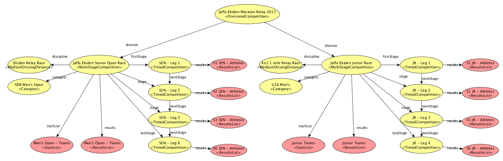

# OpenTrack Abstract Model 

**Latest published version:**
  * [https://w3c.github.io/opentrack-cg/spec/model/overview](https://w3c.github.io/opentrack-cg/spec/model/overview)

**Latest editor's draft:**
  * [https://github.com/w3c/opentrack-cg/blob/master/spec/model/overview.md](https://github.com/w3c/opentrack-cg/blob/master/spec/model/overview.md)

**Participate:**
  * [https://www.w3.org/community/opentrack/](https://www.w3.org/community/opentrack/)
    

## Introduction

This section describes the conceptual model for OpenTrack. As described in [the charter](https://w3c.github.io/opentrack-cg/charter.html), this model describes data related to Athletics competitions including: Track and Field; Road Running; Race Walking; Cross-Country Running; Mountain Running; and trail Running disciplines.

This model will be focus on Athletics competitions, having into account: events; athletes and teams; results; performances; management of start lists; results; and facilities. 

This document specifies the model in an abstract way, not the implementation of the final vocabulary.  

<mark>This is a work in progress.</mark> No section should be considered final, and the absence of any content does not imply that such content is out of scope, or may not appear in the future. If you feel something should be covered, please [tell us](https://github.com/w3c/opentrack-cg/issues).
    
    
## Background and References

OpenTrack descriptions need homogeneous classes, properties and data types to specify values of properties. This work is based [on existing requirements](http://opentrack.run/standards/), and rules set up by [IAAF](http://iaaf.org).

Some of the entities referred in this document, are named using abbreviations. These are the main organizations involved in the management and definition of Athletics rules:

* AIMS - [Association of International Marathons and Distance Races](http://www.aimsworldrunning.org)
* EA - [European Athletics](http://www.european-athletics.org/) ([EA's Member Federations](http://www.european-athletics.org/member-federations/)).
* IAAF - [International Association of Athletics Federations](http://iaaf.org) ([IAAF's Member Federations](https://www.iaaf.org/about-iaaf/structure/member-federations))
* IAU - [International Association of Ultrarunners](http://www.iau-ultramarathon.org)
* IOC - [International Olympic Committee](https://www.olympic.org/the-ioc)
* IPC - [International Paralympic Committee](http://www.paralympic.org/athletics)
* ITRA - [International Trail Running Association](http://www.i-tra.org/)
* WMA - [World Masters Athletics](http://www.world-masters-athletics.org)
* WMRA - [World Mountain Running Association](http://www.wmra.info)
* NACAC – [North American, Central American and Caribbean Athletic Association](http://www.athleticsnacac.org/)
* CONSUDALE - [Confederación Sudamericana de Atletismo](http://consudatle.org/)

There are other vocabularies modeling sports:
* BBC [Sports Ontology](http://www.bbc.co.uk/ontologies/sport#).
* IPTC [SportsML](http://dev.iptc.org/SportsML) ([Example](http://dev.iptc.org/files/SportsML-Examples/sportsml-tournament-olympic.xml)).
* [Schema.org](http://schema.org/SportsEvent).
* Wikipedia [infobox template](https://en.wikipedia.org/wiki/Template:Infobox_sports_competition_event) for Wikipedia articles about Athletics results.


## Overview of the model

The model is related to the competition management in Athletics. By using this model systems will be able to describe, collect, process, store and publish Athletics information.  

In order to represent properly the model, the work was divided in two parts: 
1. **Competitors**, organizations and stakeholders involved in the competition; and
2. **Competitions** (scheduling and results).


### Competitors and affiliation


* **[Competitors](#competitors)**. **[Athletes](#athletes)** or **[Teams](#teams)** that takes part in Athletics events. Athletes are defined by gender, age, nationality, affiliation to club and/or federation, and other personal information. Both athletes and teams can be attached to [Clubs](#clubs) as organizations.

* **[Federations](#federations)**. Sports governing bodies in charge of governing and rule Athletics in specific territories. [Federations](#federations) may be attached to other higher-level federations. **[Athletes](#athletes)**, **[Teams](#teams)**, and **[Clubs](#clubs)** may be attached to federations. 

### Athletics Competitions

The following UML diagram represents competition management in Athletics: 


* **[Competitions](#competitions)**. Organized occasions where Athletics events are planed and take place at a specific location during a period of time. Most Athletics events are part of a bigger meeting, or competition. These competitions can be organized periodically ([Competition Series](#competition-series)), such as the Summer Olympic Games. These events may have of different nature, depending on the disciplines, schedule, competitors, and scope (e.g., championships tournaments, leagues, fund-raising road races, etc.). Athletics competitions may divided in several [Competitions](#athletics-competitions) ([Divisional Competition](#divisional-competitions) such as [Summer Olympic Games](https://en.wikipedia.org/wiki/Athletics_at_the_Summer_Olympics) include 24 independent event disciplines for men and 23 for women); they may include several stages ([Multi Stage Competitions](#multi-stage-competitions) like the Diamond League); also competitions may be composed of several disciplines ([Multi Discipline Competitions](#multidiscipline-competitions) are combined events such as Decathlon).

* **[Rounds](#rounds)**. Stages of Athletics competitions (e.g., qualifying rounds, semifinals, final, etc.) where competitors are distributed in groups. Rounds depend on the competition rules for each discipline, so there is a difference between rounds within timed events, and rounds in field events. Vertical jumps have different rules regarding rounds in field events.  

* **[Venues](#venues)**. Location where events and competitions are held.

* **[Category](#category)**. Specific category of an event (e.g., Senior Men, U18 Women, etc.).

* **[Field Trials Rounds](#field-trials-rounds)**. Rounds of Field Events include one of several rounds of [Trials](#field-trials), where athletes have different attempts to achieve their best performance in the competition.  

* **[Competition Entries](#competition-entries)** are those athletes or teams that take part in an Athletics event, identified by specific information such as bib number, and best performance for the specific discipline of the event. This entry information is relative to the competition and relevant for **[Results](#results)**.

* **[Results](#results)** is a list of competitors (entries in the competition) with their **performances** after an event or a concrete round— It serves as ranking for each stage of the competition. Result list items will include information about the impact of the performance in the competition (i.e., records, disqualifications, competition 'under protest', etc.).

* **[Performances](#performances)**. Resulting competitor's accomplishment recognized by judges after a competition round. Measurements depend on the type of discipline (i.e., running performances are measured as time, jumps and throws are measured in centimetres). It may include information about the conditions in which competitor got the performance (e.g., wind speed). 

* **[Field Trials](#field-trials)**. Each one of the attempts performed by athletes within a round of trials ([Field Trials Round](#field-trials-rounds)).  


## Entities 

A **Competitor** is an agent that takes part in Athletics events. Depending on the type of event, either for individuals or for teams, agent is either an **[Athlete](#athletes)** or a **[Team](#teams)**, respectively. 

### Athletes

An **Athlete** is a **[Person](#persons)** who participates in Athletics events. Athletes may be described using the following attributes:

| Property | Description | Value Type |
|:-------- |:----------- |:---------- |
| identifier | Unique character string to identify a person as an athlete. | Text |
| name | Athlete's full name. | Text |
| family name | Athlete's family name; surname. | Text |
| given name | Athlete's given name; first name. | Text |
| previous family name | Athlete's former family name; surname. | Text |
| previous given name | Athlete's former given name; first name. | Text |
| alternate name | An alias to name an athlete. | Text |
| address | Main residence address of an athlete. | [Postal Address](#postal-addresses) or Text |
| image | Picture of an athlete. | URL |
| email | Email address. | Text |
| url | Webpage URL about an athlete. | URL |
| award(s) | Award(s) and prize(s) given to an athlete. | Text |
| gender | Athlete's gender. | [Gender](#gender) |
| height | Athlete's height. | [Distance](#distance) |
| weight | Athlete's weight. | [Mass](#mass) |
| nationality | Athlete's nationality. | [Country](#countries) |
| date of birth | Date of birth. | [Date](#dates-and-time) |
| date of death | Date of death. | [Date](#dates-and-time) |
| birth place | Locality and country of birth (e.g. "Tallinn, Estonia") | Text |
| affiliation(s) | Organization (i.e., federation, club, school or other institution) which an athlete is attached to. | [Organization](#organizations) |
| coach(es) | Athlete's main coach(es). | [Person](#persons) |
| sponsor(s) | Athlete's sponsor(s). | [Person](#persons) or [Organization](#organizations) |
| team(s) | Team(s) which the athlete is part of (for instance, a National Team). | [Team](#teams) |
| records(s) | Athlete's records and best performances. | [Record](#records) |  


Example:
```
{
    "@context": "http://w3c.github.io/opentrack-cg/contexts/opentrack.jsonld",
    "@id" : "http://w3c.github.io/opentrack-cg/examples/athlete/001Farah.jsonld",
    "@type" : "Athlete",
    
    "name" : "Mohamed Muktar Jama Farah",
    "familyName" : "Farah",
    "givenName" : "Mohamed Muktar Jama",
    "alternateName" : "Mo Farah",               
    "url" : "http://www.mofarah.com",
    "gender" : "Male" ,
    "image" : "https://example.com/260px-MoPodiumRio2016.png",
    "nationality" : "UK",                       
    "email" : "fakeemail@example.com",
    "height" : "175 cm",
    "weight" : "65 Kg",   
    "birthPlace" : "Mogadishu, Somalia" ,
    "birthDate" : "1983-04-23",
    "coach" : { 
        "name" : "Alberto Salazar" 
    },
    "sponsor" : {
        "@type" : "Organization",
        "name" : "Nike Oregon Project",
        "url" : "https://nikeoregonproject.com"            
    },
    "affiliation" : [ 
           "http://w3c.github.io/opentrack-cg/examples/club/NEB.jsonld",
           "http://w3c.github.io/opentrack-cg/examples/club/NOP.jsonld"
        ],
    "team" : [ 
           "http://w3c.github.io/opentrack-cg/examples/team/GBR2012.jsonld",
           "http://w3c.github.io/opentrack-cg/examples/team/GBR2016.jsonld"
        ],
    "affiliation" :
        [ 
           "http://w3c.github.io/opentrack-cg/examples/federation/GBR.jsonld", 
           "http://w3c.github.io/opentrack-cg/examples/federation/USATF.jsonld" 
        ],
    "bestPerformance" :
        [
           "http://w3c.github.io/opentrack-cg/examples/performance/001Farah.jsonld#HMarathon",
           "http://w3c.github.io/opentrack-cg/examples/performance/001Farah.jsonld#1500m",
           "http://w3c.github.io/opentrack-cg/examples/performance/001Farah.jsonld#3000m"
        ]
}
```

### Clubs

A **sports club**, **sport club** or **athletics club**, is an [Organization](#organizations) for [Athletes](#athletes) formed for the purpose of playing sports. Clubs may have different [Teams](#teams) created for specific competitions, such as leagues, relay races, etc. 

Clubs may be described using the following attributes:

| Property | Description | Value Type |
|:-------- |:----------- |:---------- |
| identifier | Unique character string to identify a club. | Text |
| name | Descriptive name of a club. | Text |
| alternate name | An alias to name a club. | Text |
| address | Main postal address where a club is registered or located. | [Postal Address](#postal-addresses) or Text |
| image | Picture of a club. | URL |
| logo | Logo or flag of the club. | URL |
| email | Main email address of the club. | Text |
| telephone | Telephone number of a club | Text |
| fax | Fax number of a club | Text |
| url | Club's homepage. | URL |
| dissolved | Date when a team was dissolved. | [Date](#dates-and-time) |
| established | Date when a team was established. | [Date](#dates-and-time) |
| member of | Organization which a club is attached to. | [Organization](#organizations) |
| sponsor(s) | Sponsor(s) of a club. | [Person](#persons) or [Organization](#organizations) |
| athlete(s) | Athlete(s) members of a club. | [Athlete](#athletes) |
| team(s) | Teams(s) attached to a club. | [Team](#teams) |

Example:
```
{
    "@context": "http://w3c.github.io/opentrack-cg/contexts/opentrack.jsonld",
    "@id" : "http://w3c.github.io/opentrack-cg/examples/club/NEB.jsonld",
    "@type" : "Club",

    "name": "Newham & Essex Beagles",
    "alternateName": "BeaglesAC",
    "url": "http://www.newhamandessexbeagles.co.uk/",
    "image": "http://example.org/image.png",
    "logo": "http://example.org/logo.png",
    "telephone": "(+44) 020 7511 6463",
    "faxNumber": "(+44) 020 7511 4477",
    "email": "fakeemail@example.org",
    "address": {
        "name": "Terence McMillan Stadium - Newham Leisure Centre",
        "streetAddress": "281 Prince Regent Lane",
        "addressLocality": "London",
        "postalCode": "E13 8SD",
        "addressCountry": "country:GBR"
    },
    "sponsor": "Asics",
    "athlete": [
        "http://w3c.github.io/opentrack-cg/examples/athlete/001Farah.jsonld",
        "http://w3c.github.io/opentrack-cg/examples/athlete/002Athlete2.jsonld",
        "http://w3c.github.io/opentrack-cg/examples/athlete/003Athlete3.jsonld"
    ],
    "memberOf" : "http://w3c.github.io/opentrack-cg/examples/federation/GBR.jsonld" 
}
```

### Teams

**Team** is a group of [Athletes](#athletes) who play a particular sport or game together against other similar groups of people. In Athletics there are certain events designed for teams competition (e.g., relay races). Teams in those competitions may be composed of [Athletes](#athletes) of the same club, representing a federation (national, regional team), or just a joint of athletes. 

Teams are considered as competitors and may be described using the following attributes:

| Property | Description | Value Type |
|:-------- |:----------- |:---------- |
| identifier | Unique character string to identify a team. | Text |
| name | Descriptive name of a team. | Text |
| alternate name | An alias to name a team. | Text |
| image | Picture of a team. | URL |
| logo | Logo or flag of a team. | URL |
| url | Webpage URL about a team. | URL |
| member of | Organization which a team is attached to. | [Organization](#organizations) |
| nationality | Teams's nationality. | [Country](#countries) |
| sponsor(s) | Sponsor(s) of a team. | [Person](#persons) or [Organization](#organizations) |
| coach(es) | Person(s) who acts as coach for a team. | [Person](#persons) |
| records(s) | Records and best performances of a team (e.g., relay competitions). | [Record](#record) |  
| captain(s) | Athlete(s) in charge of a team. | [Athlete](#athletes) |
| athlete(s) | Athlete(s) affiliated to a team. | [Athlete](#athletes) |


_Example of definition of a national team as competitor in a 4x100:_


_Example of definition of a club forming a team for Ekiden:_


Example of a national team (with two athletes):
```
{
    "@context": "http://w3c.github.io/opentrack-cg/contexts/opentrack.jsonld",
    "@id" : "http://w3c.github.io/opentrack-cg/examples/team/GBR2016.jsonld",
    "@type" : "Team",
    
    "name" : "Great Britain National Team - Olympic Games 2016",
    "alternateName" : "GBR",               
    "location" : "country:GBR",                       
    "memberOf" : "http://w3c.github.io/opentrack-cg/examples/federation/GBR.jsonld",
    "athlete" : [
        "http://w3c.github.io/opentrack-cg/examples/athlete/001Farah.jsonld",
        "http://w3c.github.io/opentrack-cg/examples/athlete/002Butchart.jsonld",
        "http://w3c.github.io/opentrack-cg/examples/athlete/004Athlete4.jsonld",
        "http://w3c.github.io/opentrack-cg/examples/athlete/005Athlete5.jsonld",
        "http://w3c.github.io/opentrack-cg/examples/athlete/006Athlete6.jsonld",
        "http://w3c.github.io/opentrack-cg/examples/athlete/006Athlete7.jsonld"
    ],
    "captain" :  "http://w3c.github.io/opentrack-cg/examples/athlete/001Farah.jsonld"
}
```

### Persons

**Person** is a basic entity to represent any person. Every person may play one or more roles (i.e., athlete, coach, organizer, etc.). 

There are some properties that will be used commonly to represent people:

| Property | Description | Value Type |
|:-------- |:----------- |:---------- |
| identifier | Unique character string to identify a person. | Text |
| name | Person's full name. | Text |
| family name | Person's family name; surname. | Text |
| given name | Person's given name; first name. | Text |
| alternate name | An alias to name a person. | Text |
| address | Main residence address of a person. | [Postal Address](#postal-addresses) or Text |
| image | Picture of a person. | URL |
| email | Email address of a person. | Text |
| url | Webpage URL about a person. | URL |


Example:
```
{ 
    "@type" : "Person",
    "name" : "Alberto Salazar" 
}
```


### Organizations

**Organization** is a basic entity to represent any type of organization (i.e., private company, public body, association, etc.). 

Organizations can be represented by the following properties:

| Property | Description | Value Type |
|:-------- |:----------- |:---------- |
| identifier | Unique character string to identify an organization. | Text |
| name | Name of an organization. | Text |
| alternate name | An alias to name an organization. | Text |
| address | Postal address where an organization is located. | [Postal Address](#postal-addresses) or Text |
| email | Main email address of an organization. | Text |
| url | Webpage URL about an organization. | URL |
| telephone(s) | Main telephone number(s) of an organization. | Text |
| area served | Spatial coverage of an organization, usually administrative areas (city, region, country, etc.) | [Territory and Country](#territories-and-countries) | 
| member of | Organization(s), such as higher-level federation(s), to which an organization is attached to. | [Organization](#organizations) | 
| member(s) | Person(s) or organization(s) attached to an organization. | [Person](#persons) or [Organization](#organizations) | 


#### Federations

A **Federation** is a special type of organization in charge of governing and rule the sport of athletics. These **sports governing bodies** may be attached to other higher-level federations, and have other sports organizations (clubs or other governing bodies) attached to them. 

Example of description of *European Athletics*:
```
{
    "@context": "http://w3c.github.io/opentrack-cg/contexts/opentrack.jsonld",
    "@id": "http://w3c.github.io/opentrack-cg/examples/federation/EAA.jsonld",
    "@type": "Federation",
    "name": "European Athletics",
    "alternateName": "European Athletic Association",
    "email": "office@european-athletics.org",
    "url": "http://www.european-athletics.org",
    "faxNumber": "(41 21) 313 43 51",
    "telephone": "(41 21) 313 43 50",
    "address": {
        "name": "European Athletic Association",
        "streetAddress": "Avenue Louis-Ruchonnet 16",
        "addressLocality": "Lausanne",
        "postalCode": "CH-1003",
        "addressCountry": "CHE"
    },
    "areaServed" : "Europe",
    "memberOf": "http://w3c.github.io/opentrack-cg/examples/federation/IAAF.jsonld",
    "member": [
        "http://w3c.github.io/opentrack-cg/examples/federation/ALB.jsonld",
        "http://w3c.github.io/opentrack-cg/examples/federation/AND.jsonld",
        "http://w3c.github.io/opentrack-cg/examples/federation/ARM.jsonld",
        "http://w3c.github.io/opentrack-cg/examples/federation/AUT.jsonld",
        "http://w3c.github.io/opentrack-cg/examples/federation/AZE.jsonld",
        "http://w3c.github.io/opentrack-cg/examples/federation/BLR.jsonld",
        "http://w3c.github.io/opentrack-cg/examples/federation/BEL.jsonld",
        "http://w3c.github.io/opentrack-cg/examples/federation/BIH.jsonld",
        "http://w3c.github.io/opentrack-cg/examples/federation/BUL.jsonld",
        "http://w3c.github.io/opentrack-cg/examples/federation/CRO.jsonld",
        "http://w3c.github.io/opentrack-cg/examples/federation/CYP.jsonld",
        "http://w3c.github.io/opentrack-cg/examples/federation/ALB.jsonld",
        "http://w3c.github.io/opentrack-cg/examples/federation/AND.jsonld",
        "http://w3c.github.io/opentrack-cg/examples/federation/ARM.jsonld",
        "http://w3c.github.io/opentrack-cg/examples/federation/AUT.jsonld",
        "http://w3c.github.io/opentrack-cg/examples/federation/AZE.jsonld",
        "http://w3c.github.io/opentrack-cg/examples/federation/BLR.jsonld",
        "http://w3c.github.io/opentrack-cg/examples/federation/BEL.jsonld",
        "http://w3c.github.io/opentrack-cg/examples/federation/BIH.jsonld",
        "http://w3c.github.io/opentrack-cg/examples/federation/BUL.jsonld",
        "http://w3c.github.io/opentrack-cg/examples/federation/CRO.jsonld",
        "http://w3c.github.io/opentrack-cg/examples/federation/CYP.jsonld"
    ]
}
```


### Category

**Category** is a division that marks the competition of athletes and teams in sports events. Categories describe the potential **audience** of a sports event. Categories may include restrictions of gender, age range and other specific rules depending of the sports discipline. Examples of categories in Athletics are: *M35* (Men aged 35-39), *U23* (Under 23) Men, or *ad hoc* categories for non-official competitions such as *teachers* and *parents* in school sports. There is a predefined list of [standard categories](#age-and-sex-categories) recognized by international federations.

Categories may be described by these following properties:

| Property | Description | Value Type |
|:-------- |:----------- |:---------- |
| identifier | Unique character string to identify a category. | Text |
| name | Name of a category (i.e., `Under 23 Men`, `Teachers`) | Text |
| alternate name | Code used to identify a category (i.e., `M35`, `W35`) | Text |
| description | Description and notes about a category. | Text |
| gender | Gender of athletes involved in a category.  | [Competition Gender](#competition-gender) |
| age range | Athletes' range of age to be eligible for a category.  | [Age Range](#age-range) or Text |
| ruled by | Governing body or organization that recognizes and rule the specific category.  | [Organization](#organizations) |

Example of category description (Senior Women):
```
{
    "@context": "http://w3c.github.io/opentrack-cg/contexts/opentrack.jsonld",
    "@id" : "http://w3c.github.io/opentrack-cg/examples/category/SENF.jsonld",
    "@type": "Category",
    "name": "Senior (Female)",
    "description": "Open class with no upper age limit but some limitations on younger people competing in endurance events. Female gender.",
    "requiredMinAge" : 16,
    "requiredGender" : "Female",
    "recognizingAuthority" : "http://w3c.github.io/opentrack-cg/examples/federation/IAAF.jsonld"
}
```

### Competition Series

**Competition Series** are competitive events that are held periodically (for instance, the Summer Olympic Games have recurring events organized every four years).

Competition Series may be described by the following attributes:

| Property | Description | Value Type |
|:-------- |:----------- |:---------- |
| identifier | Unique character string to identify a series of competitions. | Text |
| name | Descriptive name of a competition series. | Text |
| alternate name | An alias to name a competition series. | Text |
| description | About a competition series. | Text |
| recurring competition | A competition that happens as a recurring event within a series of competitions (e.g., *London 2012* Olympic Games) | [Competition](#competitions) |


Example of series of events:
```
{
    "@context": "http://w3c.github.io/opentrack-cg/contexts/opentrack.jsonld",
    "@id" : "http://w3c.github.io/opentrack-cg/examples/competition/EuropeanChampionships.jsonld",
    "@type": "CompetitionSeries",
    
    "name": "European Athletics Championships",
    "description": "The European Athletics Championships is a recurring event organized by European Athletics, that is held every two years. This championship gathers together the best athletes and national teams in Europe.",
    "organizer": "http://w3c.github.io/opentrack-cg/examples/federation/EAA.jsonld",
    "recurringEvent" : [
        "http://w3c.github.io/opentrack-cg/examples/competition/Euro2016.jsonld",
        "http://w3c.github.io/opentrack-cg/examples/competition/Euro2018.jsonld"
    ]
}
```

### Competitions

A **Sport Competition** is an event in which [Athletes](#athletes) take part in order to find out who is best at a particular sports activity.

Athletics [Competitions](#competitions) may be of different nature, depending on disciplines (e.g., 100m, marathon, pole vault, etc.), schedule (e.g. one-day meetings, World championships, etc.), competitors (e.g., U23, Masters, etc.), and scope (e.g., regional, national, supranational championships, leagues, etc.). Other amateur competitions such as fundraising road races or school races are also considered as [Competitions](#competitions).

Types of competitions:
* [Competition Series](#competition-series). Series of competitions that have events periodically (e.g., [2016 Summer Olympic Games in Rio](https://www.olympic.org/rio-2016/athletics) as part of the Olympic Games held every four years);
* [Multi Stage Competitions](#multi-stage-competitions), composed of a set of stages (e.g. leagues or tournaments such as [European Combined Events Team Championships Super League, Tallin 2017](http://www.european-athletics.org/competitions/european-combined-events-team-championships-super-league/) and the [European Throwing Cup, 2017](http://www.european-athletics.org/competitions/european-throwing-cup/));
* [Multi Round Competitions](multi-round-competitions), divided in a sequence of qualification rounds (e.g. 100m events that are divided in qualifying rounds, semifinals, final, etc.);
* [Divisional Competitions](#divisional-competitions), split in different divisions (e.g., [USATF Cross Country Championships](http://www.usatf.org/Events---Calendar/2017/USATF-Cross-Country-Championships.aspx) divided in different categories by gender and age range.);
* [Multidiscipline Competitions](#multidiscipline-Competitions), composed of different disciplines (e.g., [IAAF World Championships London 2017](http://www.iaafworldchampionships.com)).

Competitions may be described by the following attributes:

| Property | Description | Value Type |
|:-------- |:----------- |:---------- |
| identifier | Unique character string to identify a competition. | Text |
| name | Descriptive name of a competition. | Text |
| alternate name | An alias to name the competition. | Text |
| description | Descriptive text about a competition. | Text |
| location | Venue where a competition is held (for instance, Berlin Olympic Stadium). | [Place](#places) or Text |
| url | Webpage URL about a competition. | URL |
| image | Picture about a competition. | URL |
| start date | Date and time when a competition starts. | [DateTime](#dates-and-time) |
| end date | Date and time when a competition ends. | [DateTime](#dates-and-time) |
| status | Status of a competition according to a enumeration of potential values (i.e., scheduled, completed, etc.) | [Event Status](#event-status) |
| organizer(s) | Person(s) or organization(s) that organizes a competition. | [Person](#persons) or [Organization](#organizations) |
| contributor(s) | Person(s) or organization(s) that collaborates in the organization of a competition. | [Person](#persons) or [Organization](#organizations) |
| sponsor(s) | Person(s) or organization(s) that sponsors a competition. | [Person](#persons) or [Organization](#organizations) |
| attendee(s) | Person(s) who attends a competition. | [Person](#persons) |
| discipline | Type of an Athletics competition according to specific rules set by governing bodies (e.g., `Outdoor Sprint Relays`). | [Discipline](#disciplines) |
| category | The specific category for a competition (e.g., *M35*, *U18 Male*, *local competitors*, etc). | [Category](#category) |
| entry requirements | Requirements to take part in a competition.  | Text |
| starter(s) | Athletes(s) or teams(s) registered for the competition at the begining of the event. | [Ahtlete](#athletes) or [Team](#teams) |
| results | List with the results of the participation in a competition. There may be different results during the competition (start list, intermediate results, partial results, final results, etc.) .  | [Results List](#results-lists) |
| unit competition | Unit competition that is part of a parent competition (e.g. every heat of a semifinal round in a 200m event).  | [Unit Competition](#unit-competitions) |
| previous stage | Competition that is the previous stage of this event, within a [Multi Stage Competition](#multi-stage-competitions) (e.g. previous match in a league).  | [Competition](#competitions) |
| next stage | Competition that is the next stage of this event, within a [Multi Stage Competition](#multi-stage-competitions) (e.g. next match in a league).  | [Competition](#competitions) |


#### Multi Stage Competitions

Subclass of [Competition](#competitions).

A **Multi Stage Competition** is an athletic event organised as a set of stages. For instance, The *Diamond League* and the *Surrey Cross Country League*.

| Property | Description | Value Type |
|:-------- |:----------- |:---------- |
| first stage | First stage of a multi stage competition. | [Competition](#competitions) |
| last stage | Last stage of a multi stage competition. | [Competition](#competitions) |
| stage | A stage within a multi stage competition. | [Competition](#competitions) |


#### Divisional Competitions

Subclass of [Competition](#competitions).

A **Divisional Competition** is a competition that is divided into a number of competitions. For instace, The Boston Marathon is divided in [two divisions](http://www.baa.org/races/boston-marathon/event-information/prize-money-and-awards.aspx): *Open/overall* division and *Masters* division.

| Property | Description | Value Type |
|:-------- |:----------- |:---------- |
| division | Division of a competition. | [Competition](#competitions) |


#### Multidiscipline Competitions

Subclass of [Competition](#competitions).

A **Multidiscipline Competition** is a competition that incorporates a number of different event disciplines. For instance, the 2012 London Summer Olympic Games 2012, and the 2016 European Athletics Championships.


#### Multi Round Competitions

Subclass of [Competition](#competitions).

A **Multi Round Competition** is an athletic event organised as a sequence of rounds. For instance, track and field events are usually structured in qualification rounds (i.e, preliminary rounds, qualification rounds, semifinals and final).

| Property | Description | Value Type |
|:-------- |:----------- |:---------- |
| first round | First round in a multi round competition. | [Competition Round](#competition-rounds) |
| last round | Last round in a multi round competition. | [Competition Round](#competition-rounds) |
| round | Round in a multi round competition. | [Competition Round](#competition-rounds) |


#### Competition Rounds

Subclass of [Competition](#competitions).

A **Competition Round** is each sub-event of a [Multi Round Competition](#multi-round-competitions). Rounds in competitions have one of more [Unit Competitions](#unit-competitions) (e.g., a heat in a qualifying round, the race in the 200m final round) where competitors are distributed. The number and type of rounds depend on the competition rules for each discipline. For instance, track sprint competitions with many participants may have various heats at preliminary round, several heats at first round, two semifinals, and a final.

Competition rounds aims at qualifying athletes to next round until the final. There are competitions that only have one final round such as Marathon or Cross Country races. Examples of **Competition Rounds**: 110m Hurdles Men **Preliminary Round Heat 1**, 10,000m Men **Final**, and 110 Hurdles Man **Semifinal 1**.

Rounds are competitions that may be described also by the following properties:

| Property | Description | Value Type |
|:-------- |:----------- |:---------- |
| qualification criteria | Requirements for a competitor to get to the next round in a [Multi Round Competition](#multi-round-competitions) (e.g., a preliminary round of qualification in track events may select a number of athletes by their performance and others by heat ranking). | [Qualification Criteria](#qualification-criteria) |


#### Unit Competitions

Subclass of [Competition](#competitions).

A **Unit Competition** is a unitary competition defined by specific sports rules (for instance, the Heat 1 race at the semifinals of 100m event in the Olympic Games). [Competition Rounds](#competition-rounds) have one o more [Unit Competitions](#unit-competitions). 

There are two unit competition subtypes: 
* [Unit Field Competition](#unit-field-competition), and
* [Unit Race](#unit-races)

#### Unit Races

Subclass of [Unit Competition](#unit-competitions).

A **Unit Race** is a competitive event where performances are measured as time (i.e., races and legs in relay races). Timed events have specific information about timekeeping. This kind of events may have information about the start/finish point and the course of the race.

| Property | Description | Value Type |
|:-------- |:----------- |:---------- |
| start point | Place where a competition starts.  | [Place](#places) |
| finish point | Place where a competition finishes.  | [Place](#places) |
| course | Track with the course of a competition.  | GeoShape |
| timekeeping | Type of timekeeping used to control a competition.  | [Timekeeping](#timekeeping) |


**Examples of competitions:**

_Example of competition model: 2016 European Championships, 100m Men._


_Example of competition model: 2016 European Championships Heptathlon (simplified with only five combined events)._


_Example of instances of the [Jaffa Ekiden Relay Race](http://events.ipswichjaffa.org.uk/ekiden-relays/), representing two different categories (senior and junior), including individual results for each relay leg and the overall results (for teams):_


_Example of model for competition rounds at 100m Men - European Championships:_


See a complete [example of divisional competition (European Championships with detail of 100m event)](http://w3c.github.io/opentrack-cg/examples/competition/Euro2016.jsonld).

#### Unit Field Competitions

Subclass of [Unit Competition](#unit-competitions).

A **Unit Field Competition** is a unitary competition in field events (for instance, one group of the semifinals in a High Jump event).

| Property | Description | Value Type |
|:-------- |:----------- |:---------- |
| trial round | A round of field trials within a unit competition in a field event. | [Field Trials Round](#field-trials-rounds) |
| first trials round | The first round of field trials within a unit competition in a field event. | [Field Trials Round](#field-trials-rounds) |
| last trials round | The last round of field trials within a unit competition in a field event. | [Field Trials Round](#field-trials-rounds) |

**Unit Field Competitions** are unitary competitions for field disciplines. These competitions have a specific structure based on rounds of trials or attempts ([Field Trials Rounds](#field-trials-rounds)). 

There are two different types of Unit Field Competitions:

* [Unit Height Competition](#unit-height-competition); and
* [Unit Distance Competition](#unit-distance-competition).


##### Unit Height Competition

Subclass of [Unit Field Competition](#unit-field-competitions).

A **Unit Height Competition** is a unitary competition for height disciplines (**Vertical Jumps**). 

_Example of rounds of trials and attempts highlighted on a control card for a Height Competition (High Jump):_


Unit Height Competitions must specify specific information about the height of the bar before the competition starts.

| Property | Description | Value Type |
|:-------- |:----------- |:---------- |
| starting height | The starting height the bar is raised at the start of a vertical jumps unit competition. | [Distance](#distance) |
| increasing height | The subsequent heights to which the bar will be raised at the end of each round of trials within a vertical jumps unit competition. | Text |

_Example of model of rounds for the distance card shown in the previous example (High Jump):_


##### Unit Distance Competition

Subclass of [Unit Field Competition](#unit-field-competitions).

A **Unit Distance Competition** is a unitary competition for distance field disciplines (**Horizontal Jumps and Throws**). 

_Example of field rounds and trials highlighted on a control card for Distance Field Events (a Javelin Throw Competition):_


_Example of representation of the previous example of Javelin Throw Competition:_


### Field Trials Rounds

**Field Trials Rounds** are rounds of attempts ([Trials](#trials)) performed by each athlete in a unit competition. 

Instances of Field Trials Rounds are described by the following properties:

| Property | Description | Value Type |
|:-------- |:----------- |:---------- |
| identifier | Unique character string to identify a round of trials. | Text |
| trials round number | Correlative integer identifying a round of trials in the competition. | Number |
| competition entry | Entry about the participation of an Athlete or Team competing in a competition. | [Competition Entry](#competition-entries) |
| trial(s) | Athlete's attempt(s) in a round of trials. | [Field Trial](#field-trials) |
| first trial | Athlete's first attempt in a round of trials. | [Field Trial](#field-trials) |
| last trial | Athlete's last attempt in a round of trials. | [Field Trial](#field-trials) |
| next trials round | The next round of field trials within a unit competition in a field event. | [Field Trials Round](#field-trials-rounds) |
| previous trials round | The previous round of field trials within a unit competition in a field event. | [Field Trials Round](#field-trials-rounds) |

Field Trials Rounds have two subclasses:

* [Height Trial Round](#height-trial-rounds) (for Vertical Jumps), and
* [Distance Trial Round](#distance-trial-rounds) (for Horizontal Jumps and Throws).


#### Height Trials Rounds

Subclass of [Field Trial Round](#field-trial-rounds).

A **Height Trials Round** is a round of athlete's attempts in **Vertical Jumps**. In this type of rounds, athletes attempt jumping or vaulting a specific height. 

| Property | Description | Value Type |
|:-------- |:----------- |:---------- |
| height | The target height the bar is raised in a round. | [Distance](#distance) |
| trial round | A round of field trials within a height trials round. | [Height Trials Round](#height-trials-rounds) |
| first trials round | The first round of field trials within a height trials round. | [Field Trials Round](#field-trials-rounds) |
| last trials round | The last round of field trials within a height trials round. | [Field Trials Round](#field-trials-rounds) |


#### Distance Trials Rounds

Subclass of [Field Trial Round](#field-trial-rounds).

A **Distance Trials Round** is a round of attempts for each competitor in a distance field competition (Horizontal Jumps and Throws).

| Property | Description | Value Type |
|:-------- |:----------- |:---------- |
| height | The target height the bar is raised for a trials round. | [Distance](#distance) |


### Field Trials


A **Field Trial** is an individual unitary attempt in field competitions. 

Except for Vertical Jumps, each competitor only will have no more than one trial recorded in any one round of trials of the competition. Anyway, all trials belonging to rounds of trials will have the same structure, independently of the discipline.

Except in Vertical Jumps, a valid trial shall be indicated by the measurement taken. For the standard abbreviations and symbols to be used in all other cases see [Start lists and results](#Start lists and results). A *´substitute´* trial is given in case an athlete is hampered in a trial or it cannot be correctly recorded.

Trials may be described by the following properties:

| Property | Description | Value Type |
|:-------- |:----------- |:---------- |
| identifier | Unique character string to identify a trial. | Text |
| attempt | Number indicating the correlative number of attempts in a round of trials. | Number |
| performance | Performance achieved in case a trial was valid. | [Performance](#performances) |
| valid | Flag indicating if the trial was valid or not (failure) | Boolean |
| is substitute | Flag indicating if the trial is a *substitute* trial. | Boolean |
| in round | Field round where a trial belongs to . | [Field Trials Rounds](#field-trials-rounds) |

Examples:
```
{
    "@id" : "http://example.com/trial:HJ11",
    "@type" : "Trial",
    "numberAttempt" : 1,
    "feature" : "feature:Failed",
    "valid" : false
}

{
    "@id" : "http://example.com/trial:HJ12",
    "@type" : "Trial",
    "numberAttempt" : 2,
    "valid" : true,
    "feature" : "feature:PassedTrial",
    "performance" : "http://example.com/performance:34354"
}

```


### Competition Entries


**Competition Entry** models the participation of competitors (teams or athletes) taking part in events. Each competitor will be identified unequivocally in the competition. These entries will be reflected in [Results](#results) (and starting lists before the competition) and in other stages of the competition such as rounds of trials.

Each *entry* of the results list may include the following properties:

| Property | Description | Value Type |
|:-------- |:----------- |:---------- |
| identifier | Unique character string to identify an entry in the list of results. | Text |
| competitor | Athlete or team competing in an event. | [Athlete](#athletes) or [Team](#teams) |
| protest status | Status of the protest action of the competitor at a stage of the competition. | [Protest Status](#protest-status) |
| bib identifier | Text or number printed on the bib, identifying a competitor during the competition. | Text |
| transponder identifier | Text or code identifying a competitor by a transponder. | Text |
| category | The specific category where a this entry is included in the competition (e.g., *M35*, *U18 Male*, *local competitors*, etc). | [Category](#category) |
| in competition | Competition in which a competitor takes part. | [Competition](#competitions) |
| best performance | Best performance for the discipline related to the competition. | [Performance](#performances) |


Example of entry in a competition:
```
{
    "@id" : "http://w3c.github.io/opentrack-cg/examples/competition/Euro2016.jsonld#100W_100Haase"
    "@type" : "CompetitionEntry",    
    "competitor" : "http://w3c.github.io/opentrack-cg/examples/athlete/100Haase.jsonld",
    "bibIdentifier" : "100"
}
```

### Results

**Results** is an ordered list of competitors and their achieved performances, before (start list), during, and after the event. It serves as ranking for each stage of the competition. Result list items will include information about the impact of the performance in the competition (i.e., records, disqualifications, competition 'under protest', etc.). 

In *Combined Events*, scores are calculated according to *combined events scoring tables*.

_Example of results after the Final round in 100m Women event:_


Each *entry* of the results list may include the following properties:

| Property | Description | Value Type |
|:-------- |:----------- |:---------- |
| identifier | Unique character string to identify an entry in the list of results. | Text |
| competition entry | Entry about the participation of an Athlete or Team competing in a competition. | [Competition Entry](#competition-entries) |
| feature(s) | Set of features and notes included by officials in a starting list or results (e.g., 'Qualified without standard in field events', 'Advanced to next round by Referee') | **[Start Lists and Results](#start-lists-and-results)** |
| protest status | Status of the protest action of the competitor at a stage of the competition. | [Protest Status](#protest-status) |
| in competition | Competition in which a competitor takes part. | [Competition](#competitions) |
| starting order | Competitor's order in the start list of a competition stage. | Number |
| track lane | Track lane number assigned to a competitor in case of certain track disciplines. | Number |
| rank | Position in the ranking of results. | Integer |
| record(s) | Flags indicating records or best performances achieved after the competition competition (e.g., World Record, National Record, etc.). | [Record](#records) |
| created | Exact date and time when the results were produced. | [Date and Time](#dates-and-time) |
| modified | Exact date and time when the results were modified. | [Date and Time](#dates-and-time) |
| performance | Measure to quantify the performance of the competitor after a competition stage.  | [Performance](#performances) |
| status | Status of results (e.g., official, intermediate, etc.). | [Result Status](#result-status) |
| award | Award related to the result achieved by the athlete. | [Award](#awards) |

Example:
```
{
    "@id" : "http://w3c.github.io/opentrack-cg/examples/competition/Euro2016.jsonld#100W_R1H1_5",
    "@type": "Result",
    "name": "5th Position - 100m Women - Round 1 - Heat 1",
    "competitionEntry" : "http://w3c.github.io/opentrack-cg/examples/competition/Euro2016.jsonld#100W_104Kora",
    "trackLane": 8,
    "competitionFeature": "q",
    "rank": 5,
    "performance": {
        "@id" : "http://w3c.github.io/opentrack-cg/examples/competition/Euro2016.jsonld#100W_R1H1_104Kora",
        "@type" : "TimePerformance",
        "competitor" : "http://w3c.github.io/opentrack-cg/examples/athlete/104Kora.jsonld",
        "windAssistance" : "-0.5 m/s",
        "time" : "00:00:11.450",
        "record" : "SB"
    }
}
```


### Performances

**Performance** represents the resulting competitor's accomplishment measured and recognized by officials after a competition. Measurements depend on the type of discipline (i.e., running performances are measured as time, jumps and throws are measured in centimetres). It may include information about the conditions in which competitor got the performance (e.g., wind assistance).

_Using the previous example of result list, Shelly-Ann Fraser-Pryce's performance is: **11.09 (seconds), +0.6 (m/s wind assistance), setting a new CR record** at 100m Women Final._  

| Property | Description | Value Type |
|:-------- |:----------- |:---------- |
| identifier | Unique character string to identify a performance. | Text |
| wind assistance | Wind speed at the moment of registering the performance (it could be either positive or negative). | Text |
| record(s) | Flags indicating records and bests achieved after the competition round (e.g., World Record, National Record, Personal Best, Season Leader, etc.). | [Record](#records) |
| discipline | Type of an Athletics competition according to specific rules set by governing bodies (e.g., `Outdoor Sprint Relays`). | [Discipline](#disciplines) |
| date | Date when the athlete achieved a performance. | [Date](#dates-and-time) |
| competitor | Athlete or team that achieved the performance. | [Athlete](#athletes) or [Team](#teams) |

There are different types of performance depending on the type of event: **Timed** events with results measured as time; **Lenght** events, measured as distance (Throws, Long Jump and Triple Jump); **Height** events, measured as height (Vertical Jumps); and **Combined** events, measured as score points (Decathlon, Heptathlon, etc.). So, performances are described by the following sub-classes:

* [Time Performance](#time-performance),
* [Points Performance](#points-performance), and
* [Distance Performance](#distance-performance).


#### Time Performance

Apart from all properties of the parent class `Performance`, this entity includes:

| Property | Description | Value Type |
|:-------- |:----------- |:---------- |
| time | Official measure of a performance expressed as time. | [Time](#dates-and-time) |
| reaction time | Reaction time of an athlete during a sprint event. | [Time](#dates-and-time) |


Example of performance in a sprint event:
```
{
    "@id" : "http://w3c.github.io/opentrack-cg/examples/competition/Euro2016.jsonld#100W_R1H3_119Nguyen",
    "@type" : "TimePerformance",
    "competitor" : "http://w3c.github.io/opentrack-cg/examples/athlete/119Nguyen.jsonld",
    "windAssistance" : "-1.0 m/s",
    "time" : "00:00:11.660",
    "record" : "SB"
}
```                                    

#### Points Performance

Apart from all properties of the parent class `Performance`, this entity includes:

| Property | Description | Value Type |
|:-------- |:----------- |:---------- |
| points | Official measure of a performance expressed as score points. | Number |

Example:
```
{
    "points" : 18273
}                                        
```

#### Distance Performance

Apart from all properties of the parent class `Performance`, this entity includes:

| Property | Description | Value Type |
|:-------- |:----------- |:---------- |
| distance | Official measure of a performance expressed as distance. | [Distance](#distance) |

Example:
```
{
    "distance" : "56 m"
}                                        
```

### Qualification Criteria

**Qualification Criteria** are the requirements for the competitor to pass a qualification round. Qualification may be based on the *finishing position* or by *performance*.

| Property | Description | Value Type |
|:-------- |:----------- |:---------- |
| description | Descriptive text of the qualification criteria. | Text |
| by place or standard | Number of competitors that are qualified in a round by rank (track events) or standard (field events). | Number |
| by performance | Number of competitors that are qualified in a round by best performance. | Number |

Example:
```
{
    "@type": "QualificationCriteria",
    "description": "First 2 in each heat (Q) and the next 2 fastest (q) advance to the final",
    "byPlaceOrStandard": 6,
    "byPerformance": 2
},

```


### Timekeeping

**Timekeeping** is a process and/or mechanism of timing competitions.

There are three alternative methods of timekeeping, recognised as official by IAAF:
- **Hand Timing** (`HT`) – Hand Timing is usually given to 0.1 seconds (average the different timekeepers and rounded up);
- **Fully Automatic Timing** (`FAT`), obtained from a Photo Finish System (FAT usually given to 0.01 seconds);
- **Transponder System Timing**. Automatic timing provided by radio signal devices. Road races use a variety of chip timing systems, precision is less important than recording thousands of people easily in the right order. 

Sometimes may be of interest gathering and representing information about devices and the specific conditions of timekeeping. Thus, timekeeping is represented by the following properties:

| Property | Description | Value Type |
|:-------- |:----------- |:---------- |
| identifier | Unique character string to identify a timekeeping method. | Text |
| timekeeping type | Type of the system used. | [Timekeeping Type](#timekeeping-type) |
| name | Name of a method used for timekeeping (i.e., `Hand Timing`, `Fully Automatic` or `Transponder System Timing`) | Text |
| description | Description and notes about the method used for timekeeping. | Text |
| timingDevice | Brand, model and features of the device/system used for timekeeping. | Text |

Example:
```
{
    "@id" : "http://w3c.github.io/opentrack-cg/examples/timekeeping/FAT.json",
    "@type" :  "Timekeeping",
    "timekeepingType" : "FAT",
    "name" : "Generic Fully Automated System"
}
```

### Places

**Places** are those venues of territories where events are held. Events may take part either in stadia (e.g., track and field events at Helsinki Olympic Stadium) or outside stadia (e.g., cross-country, mountain races, road races, etc.). Federations may cover specific Administrative Areas.


Venues can be described by the following attributes:

| Property | Description | Value Type |
|:-------- |:----------- |:---------- |
| identifier | Unique character string to identify a venue. | Text |
| name | Descriptive name of a venue. | Text |
| description | Descriptive text about a place. | Text |
| address | Postal address related to a venue. | [Postal Address](#postal-addresses) or Text |
| url | Webpage URL about a venue. | URL |
| image | Picture about a venue. | URL |
| geo | Coordinates of a venue. | Text |
| map | URL to a map pointing to a venue. | URL |
| telephone(s) | Telephone number(s) of a venue. | Text |
| fax number | Fax number of a venue. | Text |

Example:
```
{
    "@id": "http://w3c.github.io/opentrack-cg/examples/competition/Euro2016.jsonld#venue",
    "@type": "schema:StadiumOrArena",
    "name": "Olympic Stadium Amsterdam",
    "geo": {
        "latitude": "52.343417",
        "longitude": "4.854192"
    },
    "map": "http://example.org/map",
    "address": {
        "streetAddress": "Olympisch Stadion 2",
        "addressLocality": "Amsterdam",
        "postalCode": "1076 DE",
        "addressCountry": "NL"
    }
}
```

### Postal Addresses

A postal address may be represented by some common properties:

| Property | Description | Value Type |
|:-------- |:----------- |:---------- |
| identifier | Unique character string to identify a postal address. | Text |
| name | Descriptive name of the place (e.g., Helsinki Olympic Stadium). | Text |
| street address | The street address (e.g., Paavo Nurmen tie 1).  | Text |
| locality | The locality (e.g., Helsinki). | Text |
| post office box number | The post office box number for PO box addresses. | Text |
| postal code | The postal code (e.g., 00250)| Text |
| country | The country (e.g., Finland). | [Country](#countries) |

Example:
```
{
    "streetAddress": "Olympisch Stadion 2",
    "addressLocality": "Amsterdam",
    "postalCode": "1076 DE",
    "addressCountry": "NL"
}
```

*******


## Classification schemas and data types 

Most of the following definitions and values for this set of value schemas are extracted from the official [Technical Competition Rules](https://www.iaaf.org/about-iaaf/documents/rules-regulations) published by IAAF.


### Dates and Time

Dates and time will be represented using the [ISO 8601](https://en.wikipedia.org/wiki/ISO_8601) standard. 

Examples:
* Time (`[hh][mm][ss].sss` or `[hh]:[mm]:[ss].sss`): `04:45:38.000` (it can include the timezone `<time>±[hh]:[mm]`)
* Date (`[YYYY][MM][DD]` or `[YYYY]-[MM]-[DD]`): 2017-04-07
* Date and Time (`<date>T<time>`): `2017-04-07T04:45:38.000+00:00` 


### Distance

Measurements of the form `<Number> <Length-unit-of-measure>` (e.g., `7 ft`).

### Mass

Measurements of the form `<Number> <Mass-unit-of-measure>` (e.g., `75.3 kg`).


### Gender

Enumeration of genders with two values: 

| Code | Gender Type |
| ---- | ----------- |
| `Male` | Men and/or boys. |
| `Female` | Women and/or girls. |


### Competition Gender

Enumeration of genders with two values: 

| Code | Gender Type |
| ---- | ----------- |
| `Male` | Men and/or boys. |
| `Female` | Women and/or girls. |
| `Mixed` | Both Male and Female. |

### Start Lists and Results

According to IAAF Rule 132.4, there are official standard abbreviations and symbols used in the preparation of start lists and results:

| Code | Issue/feature |
| ------------- | ---- |
| `DNS` | Did Not Start |
| `DNF` | Did Not Finish |
| `DQ` | Disqualified |
| `R` | Retired from competition |
| `Q` | Qualified by place (track) or standard (field) |
| `q` | Qualified by performance (time in timed events and rank in field events) |
| `qR` | Advanced to next round by Referee |
| `qJ` | Advanced to next round by Jury of Appeal |
| `>` | Bent knee (Race walking) |
| `~` | loss of contact (Race walking) |
| `yC` | yellow Card |
| `yRC` | Second yellow Card |
| `RC` | Red Card |
| `Fn` | False Start |
| `o` | Clearance (valid trial in Height Events) |
| `-` | Pass (passed trial in field events) |
| `x` | Failure (failed trial in field events) |
| `NM` | No Mark |
| `NH` | No Height |
| `h` | Hand-timing |
| `a` | automatic timing with no hundredths of a second measured |
| `A` | performance achieved at altitude |
| `OT` | Oversized Track |


### Age Range

According to IAFF RULE 141 (Age and Sex Categories), apart from [Gender](#gender) competition may also be divided into specific age group classifications (Under 18, Under 20, Senior). 

EA, NACAC and CONSUDALE recognises the **`U23`** age category for those athletes aged between 20-22. Athletes under this age range may take part in the competitions. Historically, NACAC used to had a **`U25`** category for those athletes under 25. 

WMA rules the case of *Master* categories for men and women. Thes categories affects to any athlete who has reached their 35th birthday. Masters go in 5 year bands (global standard set by WMA): V35, V40, V45 etc. It is commonly conflated with gender e.g. M45, W50.

Usually, for those categories officially recognized, participators in the competitions in these categories may be athletes who have not completed their nth birthday on the 31st December of the year the competition occurs. Eligibility dates may vary depending on specific rules, such as in the case of youth sports. 

Thus, the official *standard* age ranges are: 

| Age range | Age‐group ID |
| --------- | ----------------- |
| 16 - 17 | `U18` |
| 18 - 19 | `U20` |
| 20 - 22 | `U23` |
| 23 - 34 | `SEN` |
| 35 ‐ 39 | `V35` |
| 40 ‐ 44 | `V40` |
| 45 ‐ 49 | `V45` |
| 50 ‐ 54 | `V50` |
| 55 ‐ 59 | `V55` |
| 60 ‐ 64 | `V60` |
| 65 ‐ 69 | `V65` |
| 70 ‐ 74 | `V70` |
| 75 ‐ 79 | `V75` |
| 80 ‐ 84 | `V80` |
| 85 ‐ 89 | `V85` |
| 90 ‐ 94 | `V90` |
| 95 ‐ 99 | `V95` |
| 100+ | `V100` |

**Category** should be flexible to allow organizers to create virtual categories or adapt the *official* ones.


### Territories and countries

Athletics federations are autonomous bodies in control of Athletics at different levels, depending on the territory they cover. By its geographical area covered,  federations can be local (e.g., [19 Athletics federations for each region in Spain](http://www.rfea.es/web/federacion/mapaespana.asp)), national (e.g., [British Athletics](http://www.britishathletics.org.uk/governance/about-uka/)) and supranational (e.g. [Oceania Athletics](https://athletics-oceania.com)). Federations are usually attached to other federations hierarchically. 

See list of [IAAF Member Federations](./federations.md).


#### Countries

Countries may be represented by their [ISO 3166-1](https://en.wikipedia.org/wiki/ISO_3166-1) code (e.g., `ZW` for Zimbabwe, `ZA`for South Africa, `TG` for Togo).


### Event Status

Athletics events may have a property to represent the states that they may be in:

| Code | Status |
| ---- | ------ |
| `Unscheduled` | Competition is not confirmed. |
| `Scheduled` | Competition is scheduled. |
| `Postponed` | Competition will be postponed without being rescheduled yet. |
| `Rescheduled` | Competition is rescheduled. |
| `Delayed` | An event is held up, for example by inclement weather. Can happen before or during an event.
| `Scheduled Break` | Competition has a scheduled break (`intermission` in SportsML). |
| `Running` | Competition in progress (`mid-event` in SportsML). | 
| `Interrupted` | Competition interrupted once in progress (`halted` in SportsML). | 
| `Getting Ready` | The start of the competition is imminent |
| `Finished` | Competition is over and no more action will happen on the field of play (last competitor finished). (`post-event` in SportsML) |
| `Cancelled` | Competition will not take place (`suspended`, `cancelled`, `discarded` in SportsML) |


### Records 

[Performances](#performances), if validated in competition [Results](#Results) can set records of different type:

| Code | Record Type |
| ---- | ----------- |
| `WR` | World Record |
| `=WR` | Equal World Record |
| `PR` | Paralympic Record |
| `AF` | African Record |
| `=AF` | Equal African Record |
| `AS` | Asian Record |
| `=AS` | Equal Asian Record |
| `ER` | European Record |
| `=ER` | Equal European Record |
| `AM` | American Record |
| `=AM` | Equal American Record |
| `OC` | Oceania Record |
| `=OC` | Equal Oceania Record |
| `AR` | Area (or continental) Record |
| `=AR` | Equal Area (or continental) Record |
| `NR` | National Record (for a specific country) |
| `=NR` | Equal National Record |
| `RR` | Regional Record |
| `=RR` | Equal Regional Record |
| `OR` | Olympic Record |
| `=OR` | Equal Olympic Record |
| `CR` | Championship Record |
| `=CR` | Equal Championship Record |
| `GR` | Games Record |
| `=GR` | Equal Games Record |
| `MR` | Meet Record |
| `=MR` | Equal Meet Record |
| `DLR` | Diamond League Record |
| `=DLR` | Equal Diamond League Record |
| `#` | indicates a record has not been accepted. The same mark is also used to indicate some sort of irregularity with a result. |
| `X` | indicates the athlete has been disqualified after the performance |
| `ClubR` | Club Record |

Records will be described by the type of record and the age-range category.

| Code | Record Type |
| ---- | ----------- |
| `AJR` | Area (or continental) Junior Record |
| `=AJR` | Equal Area (or continental) Junior Record |
| `EUR` | European U23 Record |
| `=EUR` | Equal European U23 Record |
| `WJR` | World Junior Record |
| `=WJR` | Equal World Junior Record |
| `EJR` | European Junior Record |
| `=EJR` | Equal European Junior Record |
| `NUR` | National U23 Record |
| `=NUR` | Equal National U23 Record |
| `NJR` | National Junior Record |
| `=NJR` | Equal National Junior Record |


#### Bests 

The concept of 'best' refers to athlete's personal achievements, without setting official records with the [Performances](#performances).

| Code | Best Type |
| ---- | ----------- |
| `WYB` | World Youth Best (the best mark achieved by an athlete in the youth age category) |
| `=WYB` | Equal World Youth Best |
| `WB` | World Best (the best mark recorded for a non-IAAF world record event) |
| `=WB` | Equal World Best |
| `PB` | Personal Best (the best mark achieved by an athlete on a personal level) |
| `=PB` | Equal Personal Best |
| `SB` | Seasonal Best (the best mark achieved by an athlete on a personal level within a given season) |
| `=SB` | Equal Seasonal Best |
| `WL` | World Leader (the best mark achieved worldwide within a given season) |
| `=WL` | Equal World Lead |
| `EL` | European Lead |
| `=EL` | Equal European Lead |
| `EB` | European Best |
| `=EB` | Equal European Best |
| `CB` | Championship Best Performance |
| `=CB` | Equal Championship Best Performance |


### Disciplines

We can identify several categories for Athletics events, depending on gender, age, type of venue, distance and type of event (e.g., 100m Hurdles Women and 110m Hurdles Men). Although events rules may vary for the same type of discipline (i.e., differences of shot weight depending on gender and/or age).

Disciplines are modelled according to this [Athletics Disciplines](./disciplines.md) model.

### Roles

Roles specified by IOC [ODF](http://odf.olympictech.org/2016-Rio/codes/HTML/common_codes/common_codes.htm). 

| Code | Role |
| ---- | ---- |
| `A` | Athlete |
| `C` | Coach |
| `G` | Guide (Paralympics only) |
| `J` | Judge |
| `S` | Technical Official (not Judge) |
| `T` | Team Official (not Coach) |


### Result Status

| Code | Status |
| ---- | ------ |
| `START_LIST` | Before competition, Start List	|
| `LIVE` | For live updates during competition |
| `INTERMEDIATE` | When competition is stopped, used at pre-defined points |
| `UNCONFIRMED` | When the unit is over but not yet unofficial or official.	Only used if other statuses do not come quickly.  |
| `UNOFFICIAL` | Results of the competition released as soon as the event is over, not waiting any official decision of the International Federation. The correctness of data must be assured.  |
| `OFFICIAL` | Results of the competition released as soon as the event is officially confirmed taking into account the resolution of the protests, etc.  |
| `PARTIAL` | Incomplete list, Final Ranking. |
| `PROTESTED` | After the competition is no longer LIVE and a protest has been lodged. After all decisions on the protest are made the ResultStatus will change to UNOFFICIAL or OFFICIAL as appropriate.  |


### Protest Status

| Code | Status |
| ---- | ---- |
| `CLS` | Closed | 
| `OPN`	| Open | 
| `PND` | Pending |  
| `ROPN` | Re Open | 


### Timekeeping Type

| Code | Type |
| ---- | ---- |
| `HT` | Hand Timing | 
| `FAT`	| Fully Automatic | 
| `TST` | Transponder System Timing | 