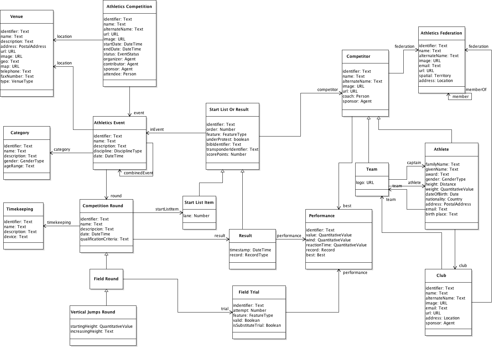

# OpenTrack Abstract Model 

## Introduction

This section describes the conceptual model for OpenTrack. As described in [the charter](https://w3c.github.io/opentrack-cg/charter.html),  this model describes data related to Athletics competitions including: Track and Field; Road Running; Race Walking; Cross-Country Running; Mountain Running; and trail Running disciplines.

This model will be focus on Athletics competitions, having into account: events; athletes and teams; results; performances; management of start lists; results; and facilities. 

This document specifies <mark>the model in an abstract way, not the implementation of the final vocabulary</mark> with classes, properties and codes.  

## Background and References

OpenTrack descriptions need homogeneous classes, properties and data types to specify values of properties. This work is based [on existing requirements](http://opentrack.run/standards/), and rules set up by [IAAF](http://iaaf.org).

Some of the entities referred in this document, are named using abbreviations. These are the main organizations involved in the management and definition of Athletics rules:

* AIMS - [Association of International Marathons and Distance Races](http://www.aimsworldrunning.org)
* EA - [European Athletics](http://www.european-athletics.org/) ([EA's Member Federations](http://www.european-athletics.org/member-federations/)).
* IAAF - [International Association of Athletics Federations](http://iaaf.org) ([IAAF's Member Federations](https://www.iaaf.org/about-iaaf/structure/member-federations))
* IAU - [International Association of Ultrarunners](http://www.iau-ultramarathon.org)
* IOC - [International Olympic Committee](https://www.olympic.org/the-ioc)
* IPC - [International Paralympic Committee](http://www.paralympic.org/athletics)
* ITRA - [International Trail Running Association](http://www.i-tra.org/)
* WMA - [World Masters Athletics](http://www.world-masters-athletics.org)
* WMRA - [World Mountain Running Association](http://www.wmra.info)
* NACAC – [North American, Central American and Caribbean Athletic Association](http://www.athleticsnacac.org/)
* CONSUDALE - [Confederación Sudamericana de Atletismo](http://consudatle.org/)

[Infobox template](https://en.wikipedia.org/wiki/Template:Infobox_sports_competition_event) for Wikipedia articles about Athletics results.


## Overview of the model

The model is related to the competition management in Athletics. By using this model systems will be able to describe, collect, process, store and publish information related to the following main entities.



The UML diagram represents three main aspects of Athletics: 

**Schedule and venues of Athletics events:**

* **[Athletics Competitions](#athletics-competitions)**. Organized occasion where Athletics events are planed and take place at a specific location during a period of time. Most Athletics events are part of a bigger meeting, or competition. These events may have of different nature, depending on the disciplines, schedule, competitors, and scope (e.g., championships tournaments, leagues, fundraising road races, etc.). Athletics events may include one or several [Athletics Events](#athletics-events) (e.g., [Summer Olympic Games](https://en.wikipedia.org/wiki/Athletics_at_the_Summer_Olympics) include 24 independent event disciplines for men and 23 for women).

* **[Athletics Events](#athletics-events)**. Competition events corresponding to specific disciplines and categories where competitors take part (e.g., 100m Men). Events may be composed of several sub-events (e.g., Combined events such as Decathlon).

* **[Venues](#venues)**. Location where events and competitions are held.

* **[Category](#category)**. Specific category of an event (e.g., Senior Men, U18 Women, etc.).

**Competitors and affiliation:**

* **[Competitors](#competitors)**. **[Athletes](#athletes)** or **[Teams](#teams)** that takes part in Athletics events. Athletes are defined by gender, age, nationality, affiliation to club and/or federation, and other personal information. Both athletes and teams can be attached to [Clubs](#clubs) as organizations.

* **[Athletics Federations](#athletics-federations)**. Sports organizations in charge of governing and rule Athletics in specific territories. [Athletics Federations](#athletics-federations) may be attached to other higher-level federations. **[Athletes](#athletes)**, **[Teams](#teams)**, and **[Clubs](#clubs) may be attached to federations. 

**Competition management:**

* **[Competition Rounds](#competition-rounds)**. Stages of Athletics competitions (e.g., Heats, Finals, etc.) where competitors are distributed in groups. Rounds depend on the competition rules for each discipline, so there is a difference between rounds within timed events, and rounds in field events. Vertical jumps have different rules regarding rounds in field events.  

* **[Timekeeping](#timekeeping)**. Method or system used for timekeeping in timed events.

* **[Start List](#start-list)**. Ordered set of competitors (athletes or teams) qualified to compete in a specific competition round. Start list contains information about competitors, the order of competition, and other competition information provided by judges. 

* **[Results](#results)**. Ordered list of competitors with their **performances** after an event or a concrete round. It serves as ranking for each stage of the competition. Result list items will include information about the impact of the performance in the competition (i.e., records, disqualifications, competition 'under protest', etc.).

* **[Performances](#performances)**. Resulting competitor's accomplishment recognized by judges after a competition round. Measurements depend on the type of discipline (i.e., running performances are measured as time, jumps and throws are measured in centimetres). It may include information about the conditions in which competitor got the performance (e.g., wind speed).

* **[Trials Rounds](#trials-rounds)**. Rounds of Field Events include one of several rounds of [Trials](#field-trials), where athletes have different attempts to achieve their best performance in the competition.  

* **[Field Trials](#field-trials)**. Each one of the attempts performed by athletes within a round of trials ([Trial Round](#trials-rounds)).  

## Schedule, Venues of Events

### Athletics Competitions

Events where Athletics competitions are planed and held. These competitions take place at a specific location during a concrete period of time. Athletics events may include one or several [Athletics Events](#athletics-events) of different nature, depending on disciplines (e.g., 100m, marathon, pole vault, etc.), schedule (e.g. one-day meetings, World championships, etc.), competitors (e.g., U23, Masters, etc.), and scope (e.g., regional, national, supranational championships, leagues, etc.). Other amateur competitions such as fundraising road races or school races are also considered Athletics competitions.

_Examples of Athletics competitions are: [IAAF World Championships London 2017](http://www.iaafworldchampionships.com), [European Throwing Cup, 2017](http://www.european-athletics.org/competitions/european-throwing-cup/), [European Combined Events Team Championships Super League, Tallin 2017](http://www.european-athletics.org/competitions/european-combined-events-team-championships-super-league/), [USATF Cross Country Championships](http://www.usatf.org/Events---Calendar/2017/USATF-Cross-Country-Championships.aspx), and [Summer Olympic Games Rio 2016](https://www.olympic.org/rio-2016/athletics)._ 

Competitions may be described by the following attributes:

| Property | Description | Value Type |
|:-------- |:----------- |:---------- |
| identifier | Unique character string to identify the competition. | Text |
| name | Descriptive name of the competition. | Text |
| alternate name | An alias to name the competition. | Text |
| description | About the competition. | Text |
| location | Venue where the event is held (for instance, Berlin Olympic Stadium). | [Venue](#venues) or Text |
| url | Webpage URL about the event. | URL |
| image | Picture about the event. | URL |
| logo | Logo of the event. | URL |
| start date | Date and time when the event starts. | [Date and Time](#date,-time-and-periods) |
| end date | Date and time when the event ends. | [Date and Time](#date,-time-and-periods) |
| status | Status of the event (planned, cancelled, etc.) | [Event Status](#Event-Status) |
| organizer(s) | Person(s) or organization(s) that organizes the event. | [Person](#persons) or [Organization](#organizations) |
| contributor(s) | Person(s) or organization(s) that collaborates in the organization of the event. | [Person](#persons) or [Organization](#organizations) |
| sponsor(s) | Person(s) or organization(s) that sponsors the event. | [Person](#persons) or [Organization](#organizations) |
| attendee(s) | Person(s) who attends the event. | [Person](#persons) |
| event(s) | Competition events that are part of the main event. | **[Athletics Event](#athletics-events)** |


Example:
```javascript
{
    '@id' : 'http://example.com/competition:0001',
    '@type' :  'Competition',
    'name' : '2016 European Athletics Championships',
    'alternateName' : 'Amsterdam Euro 2016',        
    'url' : 'http://www.european-athletics.org/competitions/european-athletics-championships/2016/events/',
    'image' : 'https://upload.wikimedia.org/wikipedia/en/thumb/d/df/Amsterdam2016logo.png',
    'location' : 'http://example.com/venue:0001',
    'startDate' : '2016-06-06',  
    'endDate' : '2016-06-10',    
    'status' : 'status:completed',
    'organizer' : 'http://example.com/federation:EA' ,
    'event' :     // List of events within the overall competition
        [
            'http://example.com/event:EURO2016_100_metres_Men',
            'http://example.com/event:EURO2016_100_metres_Women',
            'http://example.com/event:EURO2016_200_metres_Men',
            'http://example.com/event:EURO2016_200_metres_Women',
            'http://example.com/event:EURO2016_400_metres_Men',
            'http://example.com/event:EURO2016_400_metres_Women',
            // …
            'http://example.com/event:EURO2016_400x100_metres_Men',
            'http://example.com/event:EURO2016_400x100_metres_Women',
            'http://example.com/event:EURO2016_LJ_Men',
            'http://example.com/event:EURO2016_LJ_Women',
            'http://example.com/event:EURO2016_Marathon_Men',
            'http://example.com/event:EURO2016_Marathon_Women',
            'http://example.com/event:EURO2016_Heptathlon',
            'http://example.com/event:EURO2016_Decathlon'
        ]
}
```

[More use cases and examples](./examples).

### Athletics Events

Athletics events are those events that correspond to specific disciplines where competitors take part (e.g., 100m Men). These events may be part or broader Athletics competitions (e.g., 110m Hurdles at Summer Olympic Games). Athletics events are composed of one or more rounds, at least the final. 

_Examples of Athletics events are: **110m Hurdles Men** at Summer Olympic Games, **Senior Women Race** at Cross Country World Championships, and **Javelin Throw Men** at European Throwing Cup._   

Athletics events may be described by the following attributes: 

| Property | Description | Value Type |
|:-------- |:----------- |:---------- |
| identifier | Unique character string to identify the event. | Text |
| name | Descriptive name of the event (e.g., `1-1-2-4 Medley Relay Men`). | Text |
| description | Descriptive name of the event (e.g., `Medley Relay 800 meters Men: two times 100 meters legs, a 200 meters leg and a 400 meters leg`). | Text |
| start date | Date and time when the event starts. | [Date and Time](#date,-time-and-periods) |
| end date | Date and time when the event ends. | [Date and Time](#date,-time-and-periods) |
| location | Venue where this competition is held (for instance, Main Outdoor Track at Berlin Olympic Stadium). | [Venue](#venues) or Text |
| round(s) | Round(s) performed as part of the competition (preliminary heats, semifinals, final, mass start waves in road races, etc.).  | **[Competition Round](#competition-rounds)** |
| combined event(s) | Sub-events included as part of the main competition. For instance, in case of Combined Events such as Pentathlon, Heptathlon and Decathlon that are composed of several independent events. | **[Athletics Event](#athletics-events)** |
| discipline | Type of the Athletics event according to a defined taxonomy (e.g., `Outdoor Sprint Relays`). | [Disciplines](#disciplines) |
| category | The specific category for this event competition. | [Category](#category) |
| timekeeping | Type of timekeeping used to control the competition.  | [Timekeeping](#timekeeping) |
| results | List with the results after the celebration of all rounds of the event.  | **[Results](#results)** |

Example:
```javascript
{
    '@id' : 'http://example.com/event:EURO2016_Heptathlon',
    '@type' : 'Event',
    'name' : 'Heptathlon - European Championships 2016',
    'description' : 'Women\'s heptathlon at the 2016 European Athletics Championships',
    'url' : 'http://www.european-athletics.org/link_to_heptathlon_2016',
    'startDate' : '2016-07-08',
    'endDate' : '2016-07-09',
    'location' : 'http://example.com/venue:0001',  
    'discipline' : 'discipline:heptathlon',
    'category' : 'http://example.com/category:SeniorWomen'
    'subEvent' :       // Hepthatlon is composed of seven subEvents: 
        [
            {
                '@id' : 'http://example.com/event:EURO2016_Heptathlon_100mH',
                '@type' : 'Event',
                'name' : 'Heptathlon - 100m Hurdles',
                'description' : '100 Hurdles at heptathlon as part of the 2016 European Athletics Championships',
                'url' : 'http://www.european-athletics.org/link_to_heptathlon_2016_100',
                'startDate' : '2016-07-08',
                'discipline' : 'discipline:100mH',
                'round' :       // Split in three heats (1, 2 and 3)
                    [
                        'http://example.com/round:EURO2016_Heptathlon_100mH_Heat1',
                        'http://example.com/round:EURO2016_Heptathlon_100mH_Heat2',
                        'http://example.com/round:EURO2016_Heptathlon_100mH_Heat3'
                    ],
                'result' :       // Results of the overall event after rounds
                    [
                        'http://example.com/result:00001',
                        'http://example.com/result:00002'
                        // … and so on, including results for all athletes
                    ]
            },
            {
                '@id' : 'http://example.com/event:EURO2016_Heptathlon_HJ',
                '@type' : 'Event',
                'name' : 'Heptathlon - High Jump',
                'description' : 'High Jump at heptathlon as part of the 2016 European Athletics Championships',
                'startDate' : '2016-07-08',
                'discipline' : 'discipline:HJ',
                'round' :                                    // Grouped in: Group A and Group B
                    [
                        'http://example.com/round:EURO2016_Heptathlon_HJ_A',
                        'http://example.com/round:EURO2016_Heptathlon_HJ_B'
                    ],
                'result' :       
                    [
                        'http://example.com/result:00101',
                        'http://example.com/result:00102'
                        // … and so on, including results for all athletes
                    ]
            },
            {
                '@id' : 'http://example.com/event:EURO2016_Heptathlon_SP',
                '@type' : 'Event',
                'name' : 'Heptathlon - Shot Put',
                'description' : 'Shot Put at heptathlon as part of the 2016 European Athletics Championships',
                'startDate' : '2016-07-09',
                'discipline' : 'discipline:SP',
                // Information about rounds                
                'round' :                                    // Grouped in: Group A and Group B
                    [
                        'http://example.com/round:EURO2016_Heptathlon_SP_A',
                        'http://example.com/round:EURO2016_Heptathlon_SP_B'
                    ],
                'results' :         // Final results for Shot Put
                    [
                        'http://example.com/result:00201',
                        'http://example.com/result:00202'
                        // … and so on, including results for all athletes
                    ]                
            }
            // …
            // The rest of disciplines (sub-events for heptathlon) will be defined in the same way
            // …
        ],
        // The final results for heptathlon
        'result' : 
            [
                'http://example.com/result:01201',
                'http://example.com/result:01202',
                'http://example.com/result:01203'
                // … and so on, including results for all athletes
            ]
}

```

[More use cases and examples](./examples).


### Category

Division that marks the competition of athletes and teams in events. Categories may include gender, age range and specific rules depending of the event.  

_Examples of categories are: *M35* (Men aged 35-39), *U23* (Under 23) Men, or *ad hoc* categories for non-official competitions such as *teachers* and *parents* in school sports._     

Categories will be described by these following properties:

| Property | Description | Value Type |
|:-------- |:----------- |:---------- |
| identifier | Unique character string to identify the category. | Text |
| name | Name of the category (i.e., `Under 23 Men`, `Teachers`) | Text |
| description | Description and notes about the category. | Text |
| gender | Gender of athletes involved this category. In case of mixed competitions, more than a gender may be indicated. | [Gender](#gender) |
| age range | Description of the athletes' range of age to be eligible for this category.  | Text |


Example:
```javascript
{
    '@type' :  'Category',
    'name' : 'U18 Male',
    'description' : 'Boys under 18',
    'gender' : 'gender:Male',
    'ageRange' : 'age:U18'
}

```
[More use cases and examples](./examples).


There is a predefined list of [standard categories](#age-and-sex-categories).


### Venues

**Places** where events and competitions are held. Events may take part either in stadia (e.g., track and field events at Helsinki Olympic Stadium) or outside stadia (e.g., cross-country, mountain races, road races, etc.). 


Venues can be described by the following attributes:

| Property | Description | Value Type |
|:-------- |:----------- |:---------- |
| identifier | Unique character string to identify the venue. | Text |
| name | Descriptive name of the venue. | Text |
| description | Descriptive text about the place. | Text |
| address | Postal address related to the venue. | [Postal Address](#postal-addresses) or Text |
| url | Webpage URL about the venue. | URL |
| image | Picture about the venue. | URL |
| geo | Coordinates of the venue. | Text |
| map | URL to a map pointing to the venue. | URL |
| telephone(s) | Telephone number(s) of the venue. | Text |
| fax number | Fax number of the venue. | Text |
| type | Type of the venue. | **[Venue Type](#venue-type)** |

Example:
```javascript
{
    '@id' : 'http://example.com/venue:0001'
    '@type' : 'Venue',                
    'name' : 'Olympic Stadium Amsterdam',
    'geo' : 
        {
            'latitude' : '52.343417',
            'longitude' : '4.854192'
        },
    'map' : 'http://example.org/map',
    'address' : 'http://example.org/postaladdress:0001'
}
```
[More use cases and examples](./examples).


See [RunTrack Directory](http://www.runtrackdir.com/details.asp?track=london-nh)

### Postal Addresses

A postal address may be represented by some common properties:

| Property | Description | Value Type |
|:-------- |:----------- |:---------- |
| identifier | Unique character string to identify the postal address. | Text |
| name | Descriptive name of the place (e.g., Helsinki Olympic Stadium). | Text |
| street address | The street address (e.g., Paavo Nurmen tie 1).  | Text |
| locality | The locality (e.g., Helsinki). | Text |
| post office box number | The post office box number for PO box addresses. | Text |
| postal code | The postal code (e.g., 00250)| Text |
| country | The country (e.g., Finland). | [Country](#countries) |


Example:
```javascript
{
    '@id' : 'http://example.org/postaladdress:0001',
    '@type' : 'PostalAddress',
    'streetAddress' : 'Olympisch Stadion 2',
    'addressLocality' : 'Amsterdam',
    'postalCode' : '1076 DE',
    'addressCountry' : 'country:NL'
}
```
[More use cases and examples](./examples).


## Competitors and Affiliation

Competitor is an agent that takes part in Athletics events. Depending on the type of event, either for individuals or for teams, agent is either an **[Athlete](#athletes)** or a **[Team](#teams)**, respectively. 

### Athletes

Athletes are **[Persons](#persons)** who participate in Athletics events. Athletes may be described using the following attributes:

| Property | Description | Value Type |
|:-------- |:----------- |:---------- |
| identifier | Unique character string to identify the person as athlete. | Text |
| name | Athlete's full name. | Text |
| family name | Athlete's family name; surname. | Text |
| given name | Athlete's given name; first name. | Text |
| alternate name | An alias to name the athlete. | Text |
| address | Main residence address of the athlete. | [Postal Address](#postal-addresses) or Text |
| image | Picture of the athlete. | URL |
| email | Email address. | Text |
| url | Webpage URL about the athlete. | URL |
| gender | Athlete's gender. | [Gender](#gender) |
| height | Athlete's height. | [Quantitative Value](#quantitative-values) |
| weight | Athlete's weight. | [Quantitative Value](#quantitative-values) |
| nationality | Athlete's nationality. | [Country](#countries) |
| date of birth | Date of birth. | [Date and Time](#date,-time-and-periods) |
| birth place | Locality and country of birt (e.g. "Tallinn, Estonia") | Text |
| federation(s) | Federation(s) which the athlete is attached to. | [Athletics Federation](#athletics-federations) |
| coach(es) | Athlete's main coach(es). | [Person](#persons) |
| sponsor(s) | Athlete's sponsor(s). | [Person](#persons) or [Organization](#organizations) |
| club(s) | Club(s) which the athlete is affiliated to. | **[Club](#club)** |
| team(s) | Team(s) which the athlete is part of (for instance, a National Team). | **[Team](#teams)** |
| best(s) | Athlete's best performances. | [Best](#bests) |  


Example:
```javascript
{
    '@id' : 'http://example.com/athlete:000021', 
    '@type' : 'Athlete',
    'name' : 'Mohamed Muktar Jama Farah',
    'familyName' : 'Farah',
    'givenName' : 'Mohamed Muktar Jama',
    'alternateName' : 'Mo Farah',                // How they are known
    'url' : 'http://www.mofarah.com',
    'gender' : 'gender:Male' ,
    'image' : 'https://example.com/260px-MoPodiumRio2016.png',
    'nationality' : 'country:UK',                       
    'email' : 'fakeemail@example.com',
    'height' : 
        { 
            '@type' : 'QuantitativeValue',
            'value': 175, 
            'unitCode': 'CMT'                   // 'FOT'->feet ; 'INH'->inches ; 'MTR'->meter 
        },  
    weight : 
        {
            '@type' : 'QuantitativeValue',
            'value' : 65, 
            'unitCode' : 'KGM'                  // 'LBR'->pound(lb) ; 'ONZ'->ounce(oz) 
        },   
    'birthPlace' : 'Mogadishu, Somalia' ,
    'birthDate' : '1983-04-23',             
    'address' : 'http://example.org/postaladdress:00002',
    coach : 
        { 
            '@type' : 'Person',
            'name' : 'Alberto Salazar' 
        },
    sponsor : 
        {
            '@type' : 'Organization',
            'name' : 'Nike Oregon Project',
            'url' : 'https://nikeoregonproject.com'            
        },
    club :                                  // Zero or more clubs
        [ 
            'http://example.com/club:NEB',
            'http://example.com/club:NOP'
        ],
    federation :
        [ 
            'http://example.com/federation:England_Athletics', 
            'http://example.com/federation:USATF' 
        ],
    bests :                                 // Lists to best performances
        [
            'http://example.com/performance:0000122',
            'http://example.com/performance:0000124',
            'http://example.com/performance:0002122',
            'http://example.com/performance:0000234'
            // … and so on 
        ]
}
```
[More use cases and examples](./examples).

### Clubs

An [Organization](#organizations) for [Athletes](#athletes). Clubs can create different [Teams](#teams) for specific competitions, such as leagues, relays, etc.  

Clubs may be described using the following attributes:

| Property | Description | Value Type |
|:-------- |:----------- |:---------- |
| identifier | Unique character string to identify the club. | Text |
| name | Descriptive name of the club. | Text |
| alternate name | An alias to name the club. | Text |
| address | Main postal address where the club is registered or located. | [Postal Address](#postal-addresses) or Text |
| image | Picture of the club. | URL |
| logo | Logo or flag of the club. | URL |
| email | Main email address of the club. | Text |
| telephone | Telephone number(s) of the club | Text |
| fax | Fax number(s) of the club | Text |
| url | Club homepage URL. | URL |
| federation(s) | Federation(s) which the club is attached to. | [Athletics Federation](#athletics-federations) |
| sponsor(s) | Sponsor(s) of the club. | [Person](#persons) or [Organization](#organizations) |
| team(s) | Teams(s) attached to this club. | **[Team](#teams)** |

Example:
```javascript
{
    '@id' : 'http://example.com/club:NEB',
    '@type' : 'Club',
    'name' : 'Newham & Essex Beagles',
    'alternateName' : 'BeaglesAC',                       // Alias, acronym, etc.
    'url' : 'http://www.newhamandessexbeagles.co.uk/',
    'image' : 'http://example.org/image.png',
    'logo' : 'http://example.org/logo.png',               // Logo, flag, etc.
    'telephone' : '(+44) 020 7511 6463',                  
    'fax' : '(+44) 020 7511 4477',
    'email' : 'fakeemail@example.org',
    'address' : 'http://example.org/postaladdress:0004',
    'sponsor' : 'Asics',
    'athlete' :                                           // List of athletes affiliated to the club
        [
            'http://example.com/athlete:082838',
            'http://example.com/athlete:082839',
            'http://example.com/athlete:082840'
            // … and so on
        ],
    
    memberOf : 'http://example.com/federation:England_Athletics'
}
```
[More use cases and examples](./examples).


### Teams

In certain events, such as relay races, competitors are groups of athletes or teams. These teams could be clubs, national teams, or just a joint of several athletes. 

Teams may be described using the following attributes:

| Property | Description | Value Type |
|:-------- |:----------- |:---------- |
| identifier | Unique character string to identify the team. | Text |
| name | Descriptive name of the team. | Text |
| alternate name | An alias to name the team. | Text |
| address | Main postal address where the team is registered or located. | [Postal Address](#postal-addresses) or Text |
| image | Picture of the team. | URL |
| logo | Logo or flag of the team. | URL |
| url | Webpage URL about the team. | URL |
| federation(s) | Federation(s) which the team is attached to. | [Athletics Federation](#athletics-federations) |
| sponsor(s) | Sponsor(s) of the team. | [Person](#persons) or [Organization](#organizations) |
| captain(s) | Athlete(s) who represents the team. | **[Athlete](#athletes)** |
| coach(es) | Person(s) who acts as coach for the team. | **[Person](#persons)** |
| best(s) | Best performances of the team (e.g., relay competitions). | [Best](#bests) |  
| athlete(s) | Athlete(s) affiliated to the team. | **[Athlete](#athletes)** |

Examples:
```javascript
{
    '@id' : 'http://example.com/team:KEN001',
    '@type' : 'Team',
    'name' : 'Kent Athletic Club – Cross Country 2017 Team',
    'alternateName' : 'KEN',                              // Alias, acronym, etc.
    'image' : 'http://example.org/image.png',
    'logo' : 'http://example.org/logo.png',               // Logo, flag, etc.
    'captain' : 'http://example.com/athlete:092838',
    'athlete' :                                           // List of athletes composing the team
        [
            'http://example.com/athlete:092838',
            'http://example.com/athlete:092839',
            'http://example.com/athlete:092840'
            // … and so on
        ],
    'club' : 'http://example.com/club:KEN'
}

//
// Example of National Team
//
{
    '@id' : 'http://example.com/team:JAP2017',
    '@type' : 'Team',
    'name' : 'Japan Team - Marathon 2017',
    'alternateName' : 'JAP',
    'image' : 'http://example.org/image.png',
    'logo' : 'http://example.org/logo.png',               // Logo, flag, etc.
    'captain' : 'http://example.com/athlete:122838',
    'athlete' :                                           // List of athletes composing the team
        [
            'http://example.com/athlete:122838',
            'http://example.com/athlete:122839',
            'http://example.com/athlete:122840'
            // … and so on
        ],
    'federation' : 'http://example.com/federation:JAP'
}
```
[More use cases and examples](./examples).


### Athletics Federations

Federation is a special type of organization in charge of governing and rule the sport of athletics. Federations may be attached to other higher-level federations.

Federations will have the properties of [Organizations](#organizations), adding the following:

| Property | Description | Value Type |
|:-------- |:----------- |:---------- |
| spatial | Spatial coverage of the federation, usually one or more administrative areas (city, region, country, etc.) | [Territory and Country](#territories-and-countries) | 
| memberOf | Higher-level federation(s) to which this federation is attached. | [Athletics Federation](#athletics-federations) | 
| member(s) | Lower level organization(s) attached to this federation. | [Organization](#organization) | 

Example:
```javascript
{
    '@id' : 'http://example.com/federation:England_Athletics',
    '@type' : 'Federation',
    'name' : 'England Athletics',
    'email' : 'ea@example.com',
    'faxNumber' : '(+44) 0121 347 65439',
    'telephone' : '(+44) 0121 347 65423',
    'address' : 'http://example.org/postaladdress:00012',
    'memberOf' : 'http://example.com/federation:UK',    // Member of Federation
    'member' :                                          // Members attached to this federation
        [
            'http://example.com/club:NEB',
            'http://example.com/club:THH'
            
        ]
}
```
[More use cases and examples](./examples).


### Persons

Person is a basic entity to represent any person (i.e., athlete, coach, organizer, etc.). 

There are some properties that will be used commonly to represent people:

| Property | Description | Value Type |
|:-------- |:----------- |:---------- |
| identifier | Unique character string to identify the person. | Text |
| name | Person's full name. | Text |
| family name | Person's family name; surname. | Text |
| given name | Person's given name; first name. | Text |
| alternate name | An alias to name the person. | Text |
| address | Main residence address. | [Postal Address](#postal-addresses) or Text |
| image | Picture of the person. | URL |
| email | Email address. | Text |
| url | Webpage URL about him/her. | URL |

Example:
```javascript
{ 
    '@type' : 'Person',
    'name' : 'Alberto Salazar' 
}
```
[More use cases and examples](./examples).


### Organizations

This entity may represent any type of organization (i.e., private company, public body, association, etc.). 

Organizations can be represented by the following properties:

| Property | Description | Value Type |
|:-------- |:----------- |:---------- |
| identifier | Unique character string to identify the organization. | Text |
| name | Organization name. | Text |
| alternate name | An alias to name the organization. | Text |
| address | Postal address where the organization is located. | [Postal Address](#postal-addresses) or Text |
| logo | Logo of the organization. | URL |
| email | Main email address. | Text |
| url | Webpage URL about the organization. | URL |
| telephone(s) | Main telephone number(s) of the organization. | Text |

Example:
```javascript
{
    '@type' : 'Organization',
    'name' : 'Nike Oregon Project',
    'url' : 'https://nikeoregonproject.com'            
}
```
[More use cases and examples](./examples).


## Competition Management

### Competition Rounds

Rounds are stages in Athletics events (e.g., heats, finals, throwing trials) where competitors are distributed. Number and type of rounds depend on the competition rules for each discipline. For instance, track sprint competitions with many participants may have various heats at preliminary round, several heats at first round, two semifinals, and a final.

Competition rounds aims at qualifying athletes to next round until the final. There are competitions that only have one final round such as Marathon or Cross Country races.

_Examples of Competition rounds are: 110m Hurdles Men **Preliminary Round Heat 1**, 10,000m Men **Final**, and 110 Hurdles Man **Semifinal 1**._  

Rounds in **Field events** include [Trials Rounds](#trials-rounds), where each athlete have several attempts to achieve the best performance. Depending on the discipline and the number of competitors, the number of trials varies. Athletes will be credited with their best valid performances after the rounds of trials.

Rounds may be described by the following properties:

| Property | Description | Value Type |
|:-------- |:----------- |:---------- |
| identifier | Unique character string to identify the round and/or heat. | Text |
| name | Descriptive name of the round and/or heat. | Text |
| description | Longer descriptive text of the round and/or heat. | Text |
| date | Date and time where the round and/or heat is held. | [Date and Time](#date,-time-and-periods) |
| timekeeping | (Timed Events) Type of time keeping used to control athletes' performances (manual, automatic, etc.).  | [Timekeeping](#timekeeping) |
| qualification criteria | Details what a competitor has to do to get to the next round. | Text |
| start list | List of competitors qualified to take part in the round and/or heat. | **[Start List](#start-list)** |
| results | List with the results after the celebration of the round.  | **[Results](#results)** |

#### Timed Events Rounds

Timed events have specific information about timekeeping.

Example:
```javascript
// 1st heat for 100m Hurdles
{
    '@id' : 'http://example.com/round:EURO2016_Heptathlon_100mH_Heat1',
    '@type' : 'TimedRound',
    'name' : 'Heptathlon 100m Hurdles - Heat 1',
    'description' : 'Heat 1 of 3 within Heptathlon 100m Hurdles',
    'date' : '2016-07-08T10:30:00+01:00',
    'qualificationCriteria': '3 heats without qualification. Assignation  of score points according to performance.' ,
    'timekeeping' : 'timekeeping:FAT',        
    'startList' :
        [
            'http://example.org/startlistitem:00001',
            'http://example.org/startlistitem:00002',
            'http://example.org/startlistitem:00003'
            // … All the participants in the starting list
        ],
    'result' : 
        [
            'http://example.org/result:000011',
            'http://example.org/result:000021',
            'http://example.org/result:000031'
            // … All list of results 
        ]
}

```
[More use cases and examples](./examples).


##### Timekeeping

There are three alternative methods of timekeeping, recognised as official by IAAF:
- **Hand Timing** (`HT`) – Hand Timing is usually given to 0.1 seconds (average the different timekeepers and rounded up);
- **Fully Automatic Timing** (`FAT`), obtained from a Photo Finish System (FAT usually given to 0.01 seconds);
- **Transponder System Timing**. Automatic timing provided by radio signal devices. Road races use a variety of chip timing systems, precision is less important than recording thousands of people easily in the right order. 

Sometimes may be of interest gathering and representing information about devices and the specific conditions of timekeeping. Thus, timekeeping is represented by the following properties:

| Property | Description | Value Type |
|:-------- |:----------- |:---------- |
| identifier | Unique character string to identify the timekeeping method. | Text |
| name | Name of the method used for timekeeping (i.e., `Hand Timing`, `Fully Automatic` or `Transponder System Timing`) | Text |
| description | Description and notes about the method used for timekeeping. | Text |
| device | Brand, model and features of the device/system used for timekeeping. | Text |

Example:
```javascript
{
    '@id' :  'http://example.com/timekeeping:0001',
    '@type' :  'Timekeeping',
    'name' : 'Transponder Based System',
    'description' : 'Fully automatic timekeeping system based on RFID transponders',
    'device' : 'RFID System – Brand and model'
}
```
[More use cases and examples](./examples).


#### Field Events Rounds

Competition in field events has a specific structure based on rounds of trials. 

| Property | Description | Value Type |
|:-------- |:----------- |:---------- |
| trials rounds(s) | Rounds of trials corresponding to a field event. | [Trials Round](#trials-rounds) |


Example:
```javascript
{
    '@id' : 'http://example.com/round:EURO2016_Heptathlon_SP_A',
    '@type' : 'FieldRound',
    'name' : 'Heptathlon Shot Put - Group A',
    'description' : 'Group A within Heptathlon - Shot Put',
    'date' : '2016-07-08T10:30:00+01:00',
    'qualificationCriteria' : '2 groups without qualification. Assignation of score points according to performance.' ,
    'startList' :
        [
            'http://example.org/startlistitem:000011',
            'http://example.org/startlistitem:000021',
            'http://example.org/startlistitem:000031'
            // … All the participants in the starting list
        ],
    'result' : 
        [
            'http://example.org/result:0000111',
            'http://example.org/result:0000211',
            'http://example.org/result:0000311'
            // … All list of results 
        ],
    'trialsRound' :
        [
            'http://example.com/trialsround:SP11',
            'http://example.com/trialsround:SP12',
            'http://example.com/trialsround:SP13'
        ]
}
```
[More use cases and examples](./examples).


##### Vertical Jumps Rounds

Rounds in Vertical Jumps include also specific information about height of the bar.

| Property | Description | Value Type |
|:-------- |:----------- |:---------- |
| starting height | (Vertical jumps) The starting height the bar is raised at the start of the round. | [Quantitative Value](#quantitative-values) |
| increasing height | (Vertical jumps) The subsequent heights to which the bar will be raised at the end of each round of trials. | Text |


Example:
```javascript
{
    '@id' : 'http://example.com/round:EURO2016_Heptathlon_HJ_A',
    '@type' : 'VerticalJumpRound',
    'name' : 'Heptathlon High Jump - Group A',
    'description' : 'Group A within Heptathlon High Jump',
    'date' : '2016-07-08T10:30:00+01:00',
    'qualificationCriteria' : '2 groups without qualification. Assignation of score points according to performance.' ,
    'startingHeight': "150cm" ,                     // Also as Quantitative Value
    'increasingHeight': "+3cm after each round" ,     
    'startList' :
        [
            'http://example.org/startlistitem:000011',
            'http://example.org/startlistitem:000021',
            'http://example.org/startlistitem:000031'
            // … All the participants in the starting list
        ],
    'result' : 
        [
            'http://example.org/result:HJ111',
            'http://example.org/result:HJ211',
            'http://example.org/result:HJ311'
            // … All list of results 
        ],
    'trialsRound' :
        [
            'http://example.com/trialsround:HJ11',
            'http://example.com/trialsround:HJ21',
            'http://example.com/trialsround:HJ31'
        ]
}
```
[More use cases and examples](./examples).


### Trials Rounds

**Field events** rounds are composed of **rounds of trials** that are performed by each athlete. 

| Property | Description | Value Type |
|:-------- |:----------- |:---------- |
| identifier | Unique character string to identify the round of trials. | Text |
| athlete | Athlete competing in this round of trials. | [Athlete](#athletes) or [Team](#teams) |
| feature(s) | Set of features and notes included by officials for this round of trials  (e.g., 'Qualified without standard in field events', 'Advanced to next round by Referee') | **[Start Lists and Results](#start-lists-and-results)** |
| under protest | Flag indicating the competitor will take part in the round of trials. | Boolean |
| bib identifier | Text or number identifying the competitor, printed on the bib. | Text |
| transponder identifier | (Timed events) Text or code identifying the competitor by a transponder. | Text |
| order | Competitor's order in the start list of this round. | Number |
| score points | Score points accumulated by the competitor at the start of the round in case of Combined Events such as Decathlon and Heptathlon. | Number |
| round number | Number of the round of trials. | Number |
| trial(s) | Athlete's attempt in this round of trials. | [Field Trial](#field-trials) |

Example:
```javascript
{
    '@id' : 'http://example.com/trialsround:SP11',
    '@type' : 'TrialsRound',
    'name' : 'Athlete 13 (Group A), list of attempts Shot Put',
    'order' : 1,
    'bibIdentifier': '13',
    'athlete' : 'http://example.com/athlete:29384',
    'trial' :  
        [
            'http://example.com/trial:SP11',
            'http://example.com/trial:SP12',
            'http://example.com/trial:SP13'
        ]                                    
}
```
[More use cases and examples](./examples).


#### Vertical Jumps Trials Rounds

In **Vertical Jumps** the **rounds of trials** include the height the athlete is attempting. 

| Property | Description | Value Type |
|:-------- |:----------- |:---------- |
| current height | The target height the bar is raised for this round. | [Quantitative Value](#quantitative-values) |

Example:
```javascript
{
    '@id' : 'http://example.com/trialsround:HJ11',
    '@type' : 'VerticalJumpTrialsRound',
    'name' : 'Athlete 13 (Group A), 1st round of trials with bar at 1.75m',
    'roundNumber' : 1,
    'order' : 1,
    'bibIdentifier': '13',
    'athlete' : 'http://example.com/athlete:29384',
    'currentHeight' : '1.75',
    'trial' :    // List of attempts
        [
            'http://example.com/trial:HJ11',
            'http://example.com/trial:HJ12'
        ]    
}
```
[More use cases and examples](./examples).


### Field Trials

**Field events** are composed of **rounds of trials**, where the number of trials is variable. Except for Vertical Jumps, each competitor only will have no more than one trial recorded in any one round of trials of the competition. Anyway, all trials belonging to rounds of trials will have the same structure, independently of the discipline.

Except in Vertical Jumps, a valid trial shall be indicated by the measurement taken. For the standard abbreviations and symbols to be used in all other cases see [Start lists and results](#Start lists and results). A *´substitute´* trial is given in case an athlete is hampered in a trial or it cannot be correctly recorded.

Trials may be described by the following properties:

| Property | Description | Value Type |
|:-------- |:----------- |:---------- |
| identifier | Unique character string to identify the trial. | Text |
| athlete | Athlete or team competing in this trials. | [Athlete](#athletes) or [Team](#teams) |
| feature(s) | Set of features and notes included by officials for this attempt  (e.g., 'Qualified without standard in field events', 'Advanced to next round by Referee') | **[Start Lists and Results](#start-lists-and-results)** |
| under protest | Flag indicating the competitor will take part in the round of trials. | Boolean |
| bib identifier | Text or number identifying the competitor, printed on the bib. | Text |
| attempt | Number indicating the correlative number of the attempt. | Number |
| performance | Performance achieved in case the trial was valid. | [Performance](#performances) |
| valid | Flag indicating if the trial was valid or not (failure) | Boolean |
| isSubstitute | Flag indicating if the trial is a *substitute* trial. | Boolean |

Examples:
```javascript
{
    '@id' : 'http://example.com/trial:HJ11',
    '@type' : 'Trial',
    'numberAttempt' : 1,
    'feature' : 'feature:Failed',
    'valid' : false
}

{
    '@id' : 'http://example.com/trial:HJ12',
    '@type' : 'Trial',
    'numberAttempt' : 2,
    'valid' : true,
    'feature' : 'feature:PassedTrial',
    'performance' : 'http://example.com/performance:34354'
}

```
[More use cases and examples](./examples).


### Start Lists

Rounds of competitions have **start lists**. These lists are provided by officials and include an ordered set of competitors (athletes or teams) qualified to compete in the related heat or round. 

In either a track or field  event, if an athlete makes an immediate oral protest against having been charged with a false start or a failure trial, the athlete may continue competing `under protest`.

_Example of start list of Final round in 100m Women event:_


Each entry of the start list may include the following properties:

| Property | Description | Value Type |
|:-------- |:----------- |:---------- |
| identifier | Unique character string to identify the entry in the list. | Text |
| competitor | Athlete or team competing in this round. | [Athlete](#athletes) or [Team](#teams) |
| feature(s) | Set of features and notes included by officials in the starting list (e.g., 'Qualified without standard in field events', 'Advanced to next round by Referee') | **[Start Lists and Results](#start-lists-and-results)** |
| under protest | Flag indicating the competitor will take part in the round and/or heat competing 'under protest'. | Boolean |
| bib identifier | Text or number identifying the competitor, printed on the bib. | Text |
| order | Competitor's order in the start list. | Number |
| score points | Score points accumulated by the competitor at the start of the round and/or heat, in case of Combined Events such as Decathlon and Heptathlon. | Number |

Example:
```javascript
{
    '@id' : 'http://example.org/startlistitem:000011',
    '@type' : 'StartListItem',
    'order' : '1',
    'bibIdentifier' : '1',
    'competitor' : 'http://example.com/athlete:29383'
}
```
[More use cases and examples](./examples).


#### Start Lists in Timed Events

Timed events may include specific information about the identification of athlete's chip, and track lane to be used. 

| Property | Description | Value Type |
|:-------- |:----------- |:---------- |
| transponder identifier | Text or code identifying the competitor by a transponder. | Text |
| lane | Track lane number assigned to the competitor in case of certain track disciplines. | Number |


Example:
```javascript
{
    '@id' : 'http://example.org/startlistitem:000211',
    '@type' : 'TimedEventStartListItem',
    'order' : '1',
    'bibIdentifier' : '1',
    'transponderIdentifier' : '1',
    'lane' : 2,
    'competitor' : 'http://example.com/athlete:29383'
}
```
[More use cases and examples](./examples).


### Results

'Results' is an ordered list collecting the performances achieved by competitors after a concrete round or at the end of the event. It serves as ranking for each stage of the competition. Result list items will include information about the impact of the performance in the competition (i.e., records, disqualifications, competition 'under protest', etc.).

Example of results after the Final round in 100m Women event:


Each entry of the results may include the following properties:

| Property | Description | Value Type |
|:-------- |:----------- |:---------- |
| identifier | Unique character string to identify the entry in the list. | Text |
| competitor | Athlete or team competing in this round. | [Athlete](#athletes) or [Team](#teams) |
| order | (Rank) position of the competitor in the rank after the round and/or heat. | Number |
| feature(s) | Set of features and notes included by officials after the round and/or heat (e.g., Red Card in Race Walking).  | **[Start Lists and Results](#start-lists-and-results)** |
| under protest | Flag indicating the competitor took part in the round and/or heat competing 'under protest'. | Boolean |
| bib identifier | Text or number identifying the competitor, printed on the bib. | Text |
| score points | Score points earned by the competitor in a specific round and/or heat in case of Combined Events (i.e., Decathlon, Heptathlon) and other team competitions (e.g. team competitions using score age grading). | Number |
| record(s) | Flags indicating records achieved after the competition round (e.g., World Record, National Record, etc.). | [Record](#records) |
| timestamp | Exact date and time when the results were produced. | [Date and Time](#date,-time-and-periods) |
| performance | Measure to quantify the performance of the competitor after the round and/or heat.  | **[Performance](#performances)** |

Example:
```javascript
{
    '@id' : 'http://example.com/result:234534',
    'rank' : '1',
    'bibIdentifier' : '13',
    'scorePoints' : 4587,
    'competitor' : 'http://example.com/athlete:29384',
    'timestamp' : '2016-10-15T10:31:12+01:00',
    'performance' : 'http://example.com/performance:032410'
}
```
[More use cases and examples](./examples).


### Performances

Performance represent the resulting competitor's accomplishment measured and recognized by officials after a competition round/heat. Measurements depend on the type of discipline (i.e., running performances are measured as time, jumps and throws are measured in centimetres). It may include information about the conditions in which competitor got the performance (e.g., wind assistance).

_Using the previous example of result list, Shelly-Ann Fraser-Pryce's performance is: **11.09 (seconds), +0.6 (m/s wind assistance), setting a new CR record** at 100m Women Final._  


| Property | Description | Value Type |
|:-------- |:----------- |:---------- |
| identifier | Unique character string to identify the performance univocally. | Text |
| value | Official measure of the performance (i.e., distance, height, time) | [Quantitative Value](#quantitative-values) |
| reaction time | Reaction time of the athlete during a sprint event. | [Quantitative Value](#quantitative-values) |
| wind assistance | Wind speed at the moment of registering the performance. | [Quantitative Value](#quantitative-values) |
| record(s) | Flags indicating records achieved after the competition round (e.g., World Record, National Record, etc.). | [Record](#records) |
| best(s) | Flags indicating bests achieved after the competition round (e.g., Personal Best, Season Leader, etc.). | [Best](#bests) |

Example:
```javascript
{
    '@id' : 'http://example.com/performance:032410',
    'value' : '11.21'                                   // Should be a Quantitative Value
}                                        
```
[More use cases and examples](./examples).


*******


## Classification schemas and data types 

Most of the following definitions and values for this set of value schemas are extracted from the official [Technical Competition Rules](https://www.iaaf.org/about-iaaf/documents/rules-regulations) published by IAAF.


### Date, Time and Periods

Dates and time will be represented using the [ISO 8601](https://en.wikipedia.org/wiki/ISO_8601) standard. 

Examples:
* Time (`[hh][mm][ss]` or `[hh]:[mm]:[ss]`): `04:45:38` (it can include the timezone `<time>±[hh]:[mm]`)
* Date (`[YYYY][MM][DD]` or `[YYYY]-[MM]-[DD]`): 2017-04-07
* Date and Time (`<date>T<time>`): `2017-04-07T04:45:38+00:00` 

Please, note that this representation for time is not sufficient for time performances. Sprint competitions are time scaled to 0.01 seconds, so performances need to be measured with better resolution. See [Quantitative Values](#quantitative-values).


### Quantitative Values

This entity could serve to represent the official measurement for distance, height, weight, speed (of wind), and others. Basically, the representation will be a pair value-unit. Units will use the normative list of [UN/CEFACT](https://www.unece.org/cefact/) [Common Codes for Units of Measurement](http://www.unece.org/fileadmin/DAM/cefact/recommendations/rec20/rec20_Rev9e_2014.xls).

Some Athletics disciplines (i.e., throwing events and jumps) measure performances as distance. IAAF specifies measures in whole centimetres. Also, distance describes the event in the case of races (e.g., 200m, 3000m steeplechase, length of cross-country course, etc.). In this case, distance is usually measured in meters (kilometers) or miles. 

So, when possible, measurements must be described using the following properties:


| Property | Description | Value Type |
|:-------- |:----------- |:---------- |
| value | The value of the measurement | Number |
| unit code | UN/CEFACT Common Code (3 characters) | Text |

The most used codes are: 

#### Time Unit Codes

| UN/CEFACT Common Code | Unit of Measurement |
| --------------------- | ------------------- |
| `C26` | millisecond |
| `SEC` | second |
| `MIN` | minute |
| `HUR` | hour |

#### Distance Unit Codes

| UN/CEFACT Common Code | Unit of Measurement |
| --------------------- | ------------------- |
| `MMT` | millimetre |
| `CMT` | centimetre |
| `MTR` | metre |
| `KTM` | kilometre |
| `INH` |	inch |
| `M7` |	micro-inch |
| `FOT` |	foot |
| `YRD` |	yard |
| `SMI` |	mile (statute mile) |


#### Speed Unit Codes

| UN/CEFACT Common Code | Unit of Measurement |
| --------------------- | ------------------- |
| `MTS` |	metre per second |
| `KNT` |	knot |
| `KMH` |	kilometre per hour |

#### Scoring Points 

Combined events use IAAF Scoring Tables to assign points according to performances. There is no specific code for `points`.

Examples will be provided with recommendations about the use of these quantitative units.


### Gender

Enumeration of genders with two values: 

- `Male`
- `Female`

NOTE: Competition is divided into men’s and women’s classifications, but there are mixed competitions. Although mixed competitions are not frequent, **mixed stadium competition*** in field events and in races of 5000m or longer are permitted.


### Start Lists and Results

According to IAAF Rule 132.4, there are official standard abbreviations and symbols used in the preparation of start lists and results:

| Issue/feature | Code |
| ------------- | ---- |
| Did not start | `DNS` |
| Did not finish | `DNF` |
| No valid trial recorded | `NM` |
| Disqualified | `DQ` |
| valid trial in High Jump and Pole vault | `O` |
| Failed trial in Field events | `X` |
| Passed trial in Field events | `–` |
| Retired from competition | `r` |
| Qualified by place in track events | `Q` |
| Qualified by time in track events | `q` |
| Qualified by standard in field events | `Q` |
| Qualified without standard in field events | `q` |
| Advanced to next round by Referee | `qR` |
| Advanced to next round by Jury of Appeal | `qJ` |
| Bent knee (Race walking) | `>` |
| loss of contact (Race walking) | `~` |
| yellow Card | `yC` |
| Second yellow Card | `yRC` |
| Red Card | `RC` |


### Age and Sex Categories

According to IAFF RULE 141 (Age and Sex Categories), apart from [Gender](#gender) competition may also be divided into specific age group classifications. Below, all the potential age categories are analyzed:

#### Junior

Junior (`U20`) is a category under the age of 20. Participators in the competitions in this class may be athletes who have not completed their twentieth birthday on the 31st December of the year the competition occurs.

* Under-18 (**`U18`**) Boys and Girls (16 or 17 years)
* Under-20 (**`U20`**) Men and women (19 or 19 years)

#### U23

EA, NACAC and CONSUDALE recognises the **`U23`** age category for those athletes aged between 20-22. Athletes under this age range may take part in the competitions. Historically, NACAC used to had a **`U25`** category for those athletes under 25.

#### Senior

Athletes aged 20-34 belongs to **`Senior`** age group.

#### Master

Master Men and women: Any athlete who has reached his/her 35th birthday Masters go in 5 year bands (global standard set by WMA): V35, V40, V45 etc. It is commonly conflated with gender e.g. M45, W50.


#### Youth

Youth sports includes school sport at primary and secondary school level. Below 18, most of sports and territories usually considers age categories in ranges of 2 years (represented as: `U4`, `U6`, `U8`, `U10`, `U12`, `U14`, `U16`, `U18`), but sometimes one-year age range is stablished. Age classification assignments and competition rules (disciplines) depend on each sport/federation/territory, so there are no homogeneous criteria to classify boys and girls into these categories. 

IAAF recognises the U18 category, including Boys and Girls aged 16 or 17, so this is the only category to be recognised officially into this vocabulary. 

<mark>Discussion under [Issue #5](https://github.com/w3c/opentrack-cg/issues/5).</mark>

#### Summary of Age Ranges

So, in summary:

| Age | Male age‐group ID | Female age‐group ID |
| --- | ----------------- | ------------------- |
| 16 - 17 | `U18 (Male)` | `U18 (Female)` |
| 18 - 19 | `U20 (Male)` | `U20 (Female)` |
| 20 - 22 | `U23 (Male)` | `U23 (Female)` |
| 23 - 34 | `Senior (Male)` | `Senior (Female)` |
| 35 ‐ 39 | `M35` | `W35` |
| 40 ‐ 44 | `M40` | `W40` |
| 45 ‐ 49 | `M45` | `W45` |
| 50 ‐ 54 | `M50` | `W50` |
| 55 ‐ 59 | `M55` | `W55` |
| 60 ‐ 64 | `M60` | `W60` |
| 65 ‐ 69 | `M65` | `W65` |
| 70 ‐ 74 | `M70` | `W70` |
| 75 ‐ 79 | `M75` | `W75` |
| 80 ‐ 84 | `M80` | `W80` |
| 85 ‐ 89 | `M85` | `W85` |
| 90 ‐ 94 | `M90` | `W90` |
| 95 ‐ 99 | `M95` | `W95` |
| 100+ | `M100` | `W100` |

Discussion under [Issue #4](https://github.com/w3c/opentrack-cg/issues/4).

**Category** should be flexible to allow organizers to create virtual categories or adapt the *official* ones.

### Territories and countries

Athletics federations are autonomous bodies in control of Athletics at different levels, depending on the territory they cover. By its geographical area covered,  federations can be local (e.g., [19 Athletics federations for each region in Spain](http://www.rfea.es/web/federacion/mapaespana.asp)), national (e.g., [British Athletics](http://www.britishathletics.org.uk/governance/about-uka/)) and supranational (e.g. [Oceania Athletics](https://athletics-oceania.com)). Federations are usually attached to other federations hierarchically. 

See list of [IAAF Member Federations](../federations).


#### Countries

Countries may be represented by their [ISO 3166-1](https://en.wikipedia.org/wiki/ISO_3166-1) code (e.g., `ZW` for Zimbabwe, `ZA`for South Africa, `TG` for Togo).


#### Other territories

<mark>Shall we use normalized territories from a common database such as Geonames?</mark>

### Event Status

Athletics events may have a property to represent the states that they may be in:

- `Cancelled`
- `Postponed`
- `Rescheduled`
- `Scheduled`

### Records 

(Performances)[#Performances], if validated in competition (Results)[#Results] can set records of different type:


| Code | Record Type |
| ---- | ----------- |
| `WR` | World Record |
| `OR` | Olympic Record |
| `CR` | Championship Record |
| `GR` | Games Record |
| `AR` | Area (or continental) Record |
| `NR` | National Record (for a specific country) |
| `MR` | Meet Record |
| `DLR` | Diamond League Record |
| `WJR` | World Junior Record |
| `AJR` | Area (or continental) Junior Record |
| `NJR` | National Junior Record (for a specific country) |
| `#` | indicates a record has not been accepted. The same mark is also used to indicate some sort of irregularity with a result |
| `X` | indicates the athlete has been disqualified after the performance |

Records will be described by the type of record and the age-range category.


### Bests 

The concept of 'best' refers to athlete's personal achievements, without setting official records with the (Performance)[#Performances].

| Code | Best Type |
| ---- | ----------- |
| `WYB` | World Youth Best (the best mark achieved by an athlete in the youth age category) |
| `WB` | World Best (the best mark recorded for a non-IAAF world record event) |
| `PB` | Personal Best (the best mark achieved by an athlete on a personal level) |
| `SB` | Season's Best (the best mark achieved by an athlete on a personal level within a given season) |
| `WL` | World Leader (the best mark achieved worldwide within a given season) |


### Disciplines

We can identify several categories for Athletics events, depending on gender, age, type of venue, distance and type of event (e.g., 100m Hurdles Women and 110m Hurdles Men). Although events rules may vary for the same type of discipline (i.e., differences of shot weight depending on gender and/or age).

A potential hierarchical abstract classification for **Athletics Events** is:

- **Stadia Events**: Track and Field events within stadium

  - **Outdoor Track and Field Events**: events held within outdoor stadia
    - **Outdoor Track Events**:
      - **Outdoor Sprints**: distance below 400m.
      - **Outdoor Hurdles**: distance below 400m with hurdles.
      - **Outdoor Relays**: relay events.
      - **Outdoor Middle distance**: distances over 400m up to 2000m.
      - **Outdoor Long distance**: higher distances races.
      - **Outdoor Steeplechase**: races with steeplechase obstacles.
    - **Outdoor Track Race Walking**: race walking races with standard distances up to 5000m.
  - **Outdoor Field Events**: 
    - **Outdoor Throws**: throwing events
    - **Outdoor Jumps**: vertical and horizontal jumps.
      - **Outdoor Vertical jumps**.
      - **Outdoor Horizontal jumps**.
  - **Outdoor Combined Events**: combination of disciplines such as decathlon and heptathlon.
    - **Decathlon**
    - **Outdoor Heptathlon**
   
  - **Indoor Track and Field Events**: events held within indoor stadia
    - **Indoor Track Events**:
      - **Indoor Sprints**: distance below 400m.
      - **Indoor Hurdles**: distance below 400m with hurdles.
      - **Indoor Relays**: relay events.
      - **Indoor Middle distance**: distances over 400m up to 2000m.
      - **Indoor Long distance**: higher distances races.
      - **Indoor Track Race Walking**: race walking races indoor.   
    - **Indoor Field Events**: 
      - **Indoor Throws**: throwing events
      - **Indoor Jumps**: vertical and horizontal jumps.
        - **Indoor Vertical jumps**.
        - **Indoor Horizontal jumps**.   
    - **Indoor Combined Events**: combination of disciplines such as heptathlon or pentathlon.
      - **Indoor Pentathlon**
      - **Indoor Heptathlon**
  
- **Off-Stadia Events**:
  - **Road Events**: races outside stadia, on road.
    - **Road Running**: running events on road
      - **Relays Road Running**: relay events on road (e.g. Ekiden)
    - **Road Race-Walking**: race walking outside stadium (standard distances from 5000m to 50Km).
  - **Off-road Events**: non-standard distances, surfaces and altitude, off-road.
    - **Cross Country**: races on a loop course placed on open or woodland area. 
      - **Relays Cross Country**: relay cross country events 
    - **Mountain Races**: races on off-road terrain with significant elevation gain on the route.
      - **Classic Mountain Races**: races either mainly uphill or with positive/negative altitude balanced.
      - **Long Distance Mountain Races**: off-road races that include distances of approximately 20km to 42.195km, with significant elevation gain.
      - **Relay Mountain Races**: relay mountain race competitions.
      - **Time trial Mountain Races**: mountain races with individual start times at various intervals. The results are ordered by the individual finish times.
    - **Trail Races**: trail races on a variety of terrain (including dirt roads, forest paths and single track footpaths) within a natural environment in open country (such as mountains, desert, forests or plains) that is mainly off-road. Organisers may impose or recommend obligatory security equipment applicable.


### Venue Type

<mark>Not sure about modeling the type of venue. Just as a first approach to check fesability:</mark>

Events could be held either within stadia (track and field events) or outside (cross country, mountain races, road races, and others).

Types of venues that can be considered:

- Stadium (or arena)
- Outdoor Course:
  - Road course: course on road suitable for running and race-walking competitions.
    - Circular Road Course: Start and finish line at the same point 
    - Linear Road Course: Start and finish line at different places.
  - Off-road course: off-road course on an open area.  
    - Cross Country Course: course on an open, woodland area, covered as far as possible by grass, with natural obstacles 
    - Mountain Course: open country course that is mainly off-road and can have significant elevation gain on the route, within a natural environment such as mountains, desert, forests or plains). Macadamised or concrete surface is acceptable but minimum.
      - Uphill Course: the profile of the course involves considerable amounts of ascent, and is mainly uphill.
      - Ascent/descent course: the profile of the course involves considerable amounts of ascent and descent, with start and finish at the same elevation level approximately.

These venues may be described in detail. Some proposed metadata related to the type of venue (extending the basic [description of Venue](#venues)): 

Stadium: Outdoor|Indoor
- track
  - type {Straight|Oval}
  - lanes (integer)
  - length (metres)
- Payment Accepted (cash, credit card, etc.)
- Currencies Accepted (cash, credit card, etc.)
 
Outdoor course:
- Start point (geo)
- Finish point (geo)
- aid station(s): stations for providing athletes any kind of aid such us clothing, communications, sponges, food or drinks.
- elevation gain (metres)
- elevation loss (metres)
- course geometry (polygon, polyline)
